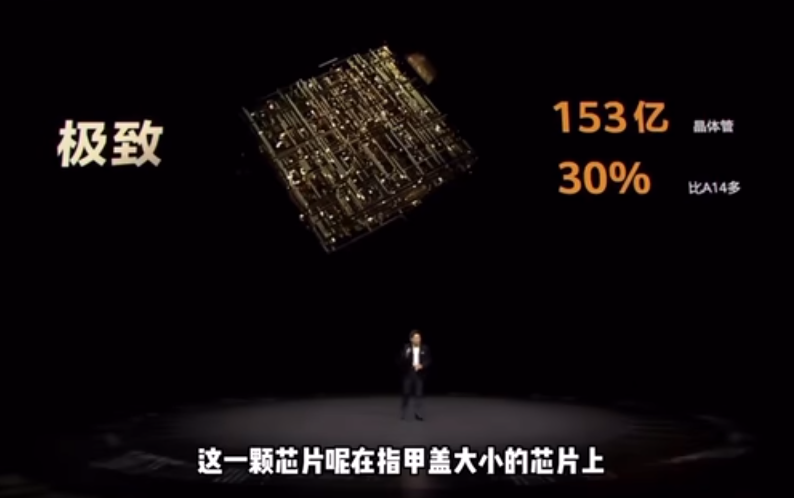
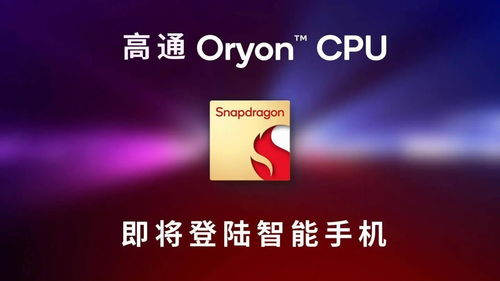

# **Lab**oratory Assignments 实验作业

!!! quote "故事开始的地方"
    “故事开始在最初的那个梦中

    我们将用一个学期来写一个很简短、不很完善的故事；但是在历史上，这个故事曾经改变世界

这是一个关于中央处理器（CPU）的故事。知乎上有一个问题：如果末日降临，你的学科只能向后世留下一句话，你会留什么？其中有一个回答是这样写的：

> 把很多与门和非门组合起来，或许会有用。

在数字逻辑与计算机组成中，我们就会学习到这种用处——事实上，今天的我们时时刻刻在感受着这种用处。从我们完成实验所需的个人计算机，到与我们衣食住行息息相关的工业互联网，都离不开一个个小小的与门与非门。

我们不禁想问

!!! question "这是一个怎样的故事？"
    与门与非门的逻辑很简单与清晰——一个小学生都能理解。与门当两个输入都为1时，输出为1；否则输出为0；非门当输入为1时，输出为0；否则输出为1。

    但是，与门与非门组合起来，是怎么实现复杂功能的呢？

数字逻辑与计算机组成将会介绍数字电路的基础知识与CPU的组成，介绍CPU的指令集、流水线等概念。在实验部分，我们将从CMOS管开始，逐步实现一个很简单的单周期非流水线式的CPU——虽然与现在的CPU相比，这个CPU的功能非常有限，但是当你写的一个简单的程序在自己设计的CPU上顺利运行并得到期望的结果时，你一定会感到无比的兴奋与自豪。

!!! info "这个故事已经写了很久"
    20世纪30年代，贝尔实验室开发的第一个电控逻辑电路是基于继电器逻辑实现的；20世纪40年代中期研制的第一台实用电子数字计算机（ENIAC）是基于真空管实现；20世纪50年代末期，半导体与晶体管逻辑电路开始取代真空管；20世纪60年代，集成电路（IC）开始出现，将二极管、三极管、电阻、电容等元件集成在一块硅片上，使数字电路向着更小更快更强的方向飞速发展。

    ——当然，如果我们想继续追溯，故事还可以更长。20世纪60年代，计算机科学家艾伦·图灵（Alan Turing）提出图灵机，是现代计算机的理论基础；20世纪50年代，计算机科学家克劳德·香农（Claude Shannon）发明了信息论，是现代数据通信的基础；公元1847年，英国数学家乔治·布尔（George Boole）发明了布尔代数，布尔代数是逻辑代数的基础；公元1671年，莱布尼兹发明了能计算加、减、乘、除的机械计算器，两年后他又提出二进制，这已经追及到牛顿《自然哲学之数学原理》与微积分之前。

!!! note "数学的魅力时刻"
    中国许多著名高校的计算机学院或计算机科学与技术系都是从数学系发展而来，而计算机的发展又与数学的发展息息相关。

!!! info "这个故事还在继续"
    2020年10月22日，华为在HUAWEI Mate 40系列全球线上发布会上发布麒麟9000芯片，其CPU采用5nm制程工艺，集成153亿个晶体管，是当时已知的晶体管数量最多的CPU。

    

    此后，携带着麒麟芯片的华为Mate 60系列、Mate 70系列的发布总是备受关注，收到消费者的热烈欢迎。

    2024年10月22日，在夏威夷举行的骁龙峰会期间，高通公司推出了骁龙8至尊版移动平台，高通表示，骁龙8至尊版是旗下最强大且全球速度最快的移动端系统级芯片。该平台首次采用了第二代定制的高通Oryon CPU、高通AdrenoGPU和增强的高通HexagonNPU，实现终端侧多模态生成式AI应用。

    

    与手机段的芯片发展类似也有些许不同，红蓝两大场在电脑CPU领域展开了激烈的竞争。Intel近年来的发展可谓举步维艰，尤其是CPU缩缸问题在消费市场上引起波澜；AMD则凭借着Zen架构的锐龙系列处理器，逐渐在高端市场站稳脚跟。

    > 你用的设备搭载了怎样的CPU？

!!! success "准备好了吗？"
    故事开始了。