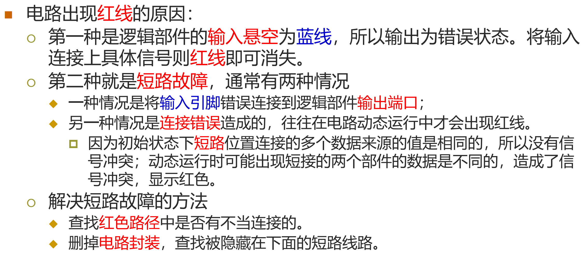
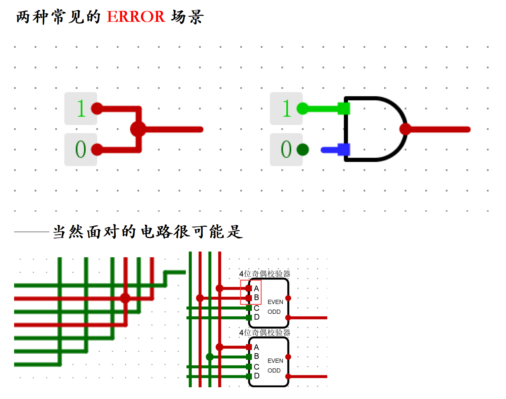
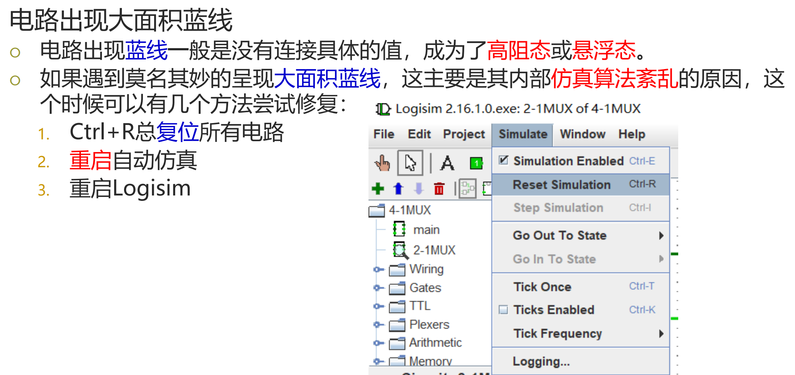

# 数字逻辑与计算机组成 实验反馈

---

## 一、电路连接与调试

### 电路连接问题

电路出现红线的原因：

本问题一般在实验一、实验二时较多，一般是由于电路连接错误导致，且刚开始实验对于调试方法不熟悉，导致较难及时发现（尤其是当意外的连线与电路元件封装重合时）。

### 新建状态、复位问题

在调试子电路时可能`新建状态`导致返回主电路时出现大规模的蓝线，需要`复位`。

同时，也建议修改后或调试（时序逻辑电路）后进行`复位`操作，比如消除了上述红线问题后如果不进行`复位`操作，有概率导致红线没有被正确消除以及`OJ评测错误`。

### 混用常量、引脚问题

在`实验2.4`中`3-8译码器`需要连接`1`和`0`，但有同学错误使用了引脚并调整相关值来进行本地测试，这会导致`OJ评测错误`。此外，本题中有部分同学并不清楚使能端的正确连接方式，在完成实验过程中造成了一定的困扰。

### 错误修改输入输出引脚

实验电路文件中提到，`请勿修改引脚名称、电路名称及电路封装外观`，错误修改到输入输出引脚可能会导致评测错误。如果遇到此类问题，可以尝试备份电路文件后重置实验，并将备份文件中的电路复制到新的实验文件中。

## 二、实验报告与提交

### 实验报告提交不规范

根据群文件`实验报告格式.pdf`中的要求，需要将实验报告以 `word` 或 `PDF` 格式保存，以`学号+姓名+实验名`为文件名，并将实验报告和电路图`.circ`文件以常用的压缩格式（`ZIP`、`RAR`等）打包上传到教学支撑平台的网站中。

实验报告提交的常见问题有：

- 只提交了实验报告文档，没有提交电路图

- 打包上传的文件含有其他无关文件，或嵌套压缩包

### 思考题相关

在实验报告中未完成思考题，或未按要求完成思考题（如遗漏要求等）。

---

2025.04.15