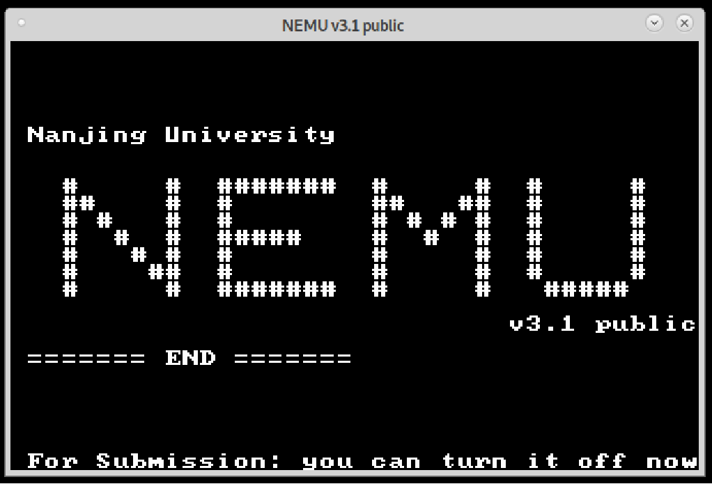
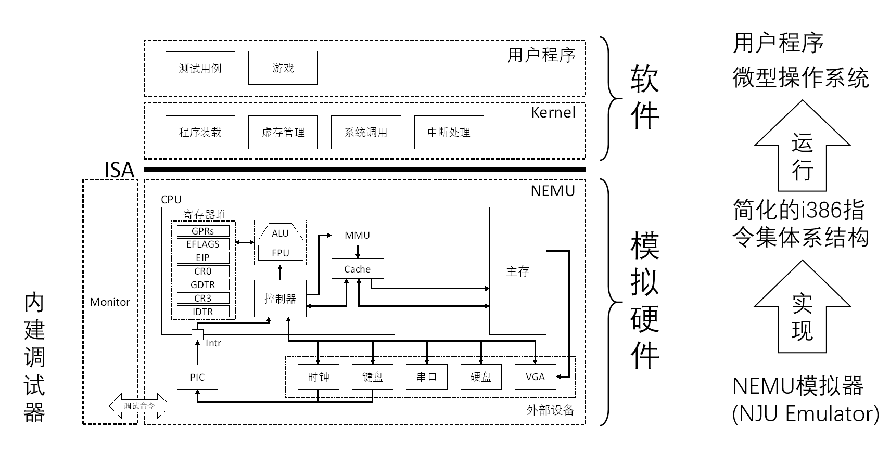
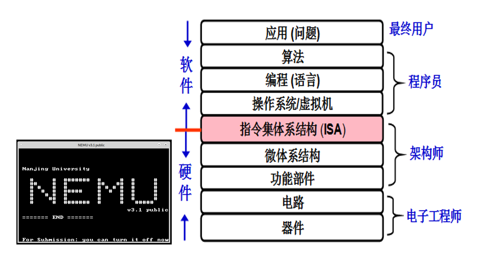

# x86模拟编程实践NEMU

PA实验的目的：实现NEMU(NEMU模拟器，NJU Emulator)，一个简化的i386模拟器——由C语言编写、以用户软件的形态运行、能够执行i386指令集程序。



想要实现一个i386模拟器，我们需要了解i386的指令集，了解CPU的运行机制，了解内存的存储机制，了解I/O设备的访问机制，这也正是《计算机系统基础》课程的主要内容。作为一个大项目，我们不可能一蹴而就，而是需要分阶段进行，以下就是NEMU的完成图景——对于硬件的模拟是主线，同时会有思考习题或选做阶段牵涉一些其他内容，如最简单的操作系统或软件。



PA体系建立于指令集体系结构(Instruction Set Architecture, ISA)，这是计算机是软件与硬件之间的桥梁，是他们共同遵守的规范。PA的重要目标就是替换ISA实现方案，用软件模拟硬件。



PA文件体系如下

```
pa_nju/
├── game              // 包含游戏相关代码
├── include           // PA整体依赖的一些文件
│   ├── config.h     // 一些配置用的宏
│   └── trap.h       // trap相关定义，不可改动
├── kernel            // 一个微型操作系统内核
├── Makefile          // 帮助编译和执行工程的Makefile
├── Makefile.git      // 和git有关的部分
├── nemu              // NEMU
│   └── src
│       └── main.c    // NEMU入口
└── testcase          // 测试用例
└── scripts           // 框架代码功能脚本，不可改动
└── libs              // 框架代码所使用的库，不可改动

```

在本实验辅助参考中，常见的提示框与释义如下：

!!! info "本阶段我该做什么"
    读读框架，写写代码

!!! question "思考习题"
    真的理解了吗？

!!! success "PA真的能HIT_GOOD_TRAP吗"
    或许

    当你看到这个提示框时，你就可以喝杯水休息、好好放松一下了。

!!! failure "两眼一黑"
    怎么PA又段错误/HIT_BAD_TRAP/ASSERT FAILED了

!!! bug "这是一个炸弹"
    怎么写了5行代码出了127个报错

!!! tip "提示"
    一个或许有用或许没用的小贴逝

!!! quote "引言"
    他们说~ 一切~ 都是~ 最好的安排

    无论成功与否，你所付出的，就是有意义的。


## x86模拟编程实践NEMU阶段

[PA 1-1 世界诞生的前夜](pa/ics_pa-1-1.md)

[PA 1-2 不停运算的机器](pa/ics_pa-1-2.md)

[PA 1-3 浮点运算的大门](pa/ics_pa-1-3.md)

[PA 2-1 简单复杂的机器](pa/ics_pa-2-1.md)

[PA 2-2 Linux中的文件](pa/ics_pa-2-2.md)

[PA 2-3 字符串求值](pa/ics_pa-2-3.md)

[PA 3-1 更快访问的追求](pa/ics_pa-3-1.md)

[PA 3-2 虚实交错的魔法](pa/ics_pa-3-2.md)

[PA 3-3 超越容量的界限](pa/ics_pa-3-3.md)

[PA 4-1 来自外部的声音](pa/ics_pa-4-1.md)

[PA 4-2 冯诺依曼的构想](pa/ics_pa-4-2.md)

[PA 4-3 编写不朽的传奇](pa/ics_pa-4-3.md)
