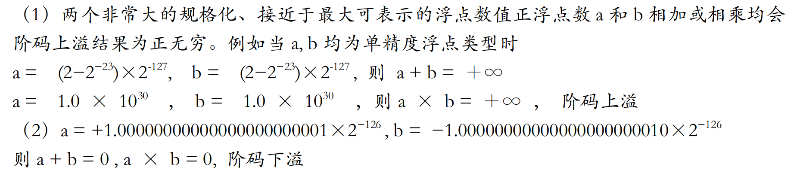
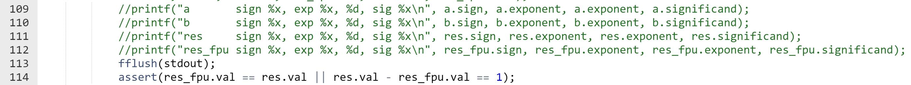

# PA 1-3 浮点数的表示和运算——浮点运算的大门

NEMU是模拟的x86体系结构，浮点数的表示和运算参照IEEE 754标准的规定。在上一节所实践的整数表示方法中，小数点约定永远在最右侧，因此可以说是一种数的定点表示方法。也可以通过约定小数点在某一特定位置来表示带小数的数字。而本节的实验中，我们参照x86体系结构的现行标准，实现IEEE 754标准的浮点数表示和运算方法。于定点数表述方法不同，浮点数表示的一个数字，其小数点所在的位置是不定（浮动）的，因此称之为浮点数。


根据IEEE 754标准的规定，单精度（32位）浮点数由最高位1位符号位（`sign`），8位阶码部分（`exponent`）和23位尾数部分（`fraction`）构成，其具体的表示方法如下：

```
  Single-precision Floating Point

  31 30    23 22                    0
  +-+--------+-----------------------+
  |s|exponent|        fraction       |
  +-+--------+-----------------------+
   s - sign                

```

在单精度浮点数的表示中，8位阶码部分采用移码形式，其偏置常数为127；对于规格化数而言，23位的尾数部分实际上表示了24位的有效数字，其最高位缺省为1。尾数加上最高位可能存在的缺省的1（非规格化浮点数没有缺省的1）后构成的有效数字在框架代码中命名为`significand`以示和不带隐藏位的`fraction`的区别。在PA实验中，我们仅关注单精度浮点数的表示和实现。双精度（64位）浮点数的表示方法与单精度浮点数非常类似，只是阶码部分扩展为11位（偏置常数1023），尾数部分扩展为52位。

## 代码实现
!!! info "FPU的模拟"
    1. 实现`nemu/src/cpu/fpu.c`中的各个浮点数运算函数；

    2. 使用`make clean`后使用`make`编译项目；

    3. 使用`make test_pa-1`命令执行NEMU并通过各个浮点数运算测试用例。

在NEMU中，浮点数的表示和运算由`nemu/src/cpu/fpu.c`中的各个浮点数运算函数实现。在`nemu/src/cpu/fpu.c`中，我们定义了如下几个浮点数运算函数。

我们的框架代码良好实现了大部分FPU的操作（包括对于浮点数特殊值如NAN的处理、浮点数加减乘除等运算），留下了几个`Todo`需要我们实现。事实上这已经大幅度降低了我们实现的难度。

首先，我们需要完善实现浮点数的规格化、非规格化、指数为0、指数为255等特殊情况的处理。基于我们理论课程的知识，相关代码补全工作不难理解，这里直接给出。
```C
inline uint32_t internal_normalize(uint32_t sign, int32_t exp, uint64_t sig_grs)
{
    // normalization
	bool overflow = false; // true if the result is INFINITY or 0 during normalize
	if ((sig_grs >> (23 + 3)) > 1 || exp < 0)
	{
		// normalize toward right
		while ((((sig_grs >> (23 + 3)) > 1) && exp < 0xff) // condition 1
			   ||										   // or
			   (sig_grs > 0x04 && exp < 0)				   // condition 2
			   )
		{

			/* TODO: shift right, pay attention to sticky bit*/
			sig_grs |= ((sig_grs & 0x1)<<1);
			sig_grs >>= 1;
            exp++;
		}

		if (exp >= 0xff)
		{
			/* TODO: assign the number to infinity */
			exp = 0xFF;
			sig_grs = 0;
			overflow = true;
		}
		if (exp == 0)
		{
			// we have a denormal here, the exponent is 0, but means 2^-126,
			// as a result, the significand should shift right once more
			/* TODO: shift right, pay attention to sticky bit*/
			sig_grs |= ((sig_grs & 0x1)<<1);
			sig_grs >>= 1;
		}
		if (exp < 0)
		{
			/* TODO: assign the number to zero */
			exp = 0;
			sig_grs = 0;
			overflow = true;
		}
	}
	else if (((sig_grs >> (23 + 3)) == 0) && exp > 0)
	{
		// normalize toward left
		while (((sig_grs >> (23 + 3)) == 0) && exp > 0)
		{
			/* TODO: shift left */
			sig_grs <<= 1;
            exp--;
		}
		if (exp >= 0xff)
		{
			/* TODO: assign the number to infinity */
			exp = 0xFF;
			sig_grs = 0;
			overflow = true;
		}
		if (exp == 0)
		{
			// denormal
			/* TODO: shift right, pay attention to sticky bit*/
			sig_grs |= ((sig_grs & 0x1)<<1);
			sig_grs >>= 1;
		}
		if (exp < 0)
		{
			/* TODO: assign the number to zero */
			exp = 0;
			sig_grs = 0;
			overflow = true;
		}
	}
	else if (exp == 0 && sig_grs >> (23 + 3) == 1)
	{
		//需要将exp++，保证阶码真值为-126
		exp++;
	}

	if (!overflow)
	{
		/* TODO: round up and remove the GRS bits */
		uint64_t temp_s = sig_grs & 0x1;
		uint64_t temp_r = (sig_grs & 0x2) >> 1;
        uint64_t temp_g = (sig_grs & 0x4) >> 2;
        if (temp_g && (temp_r || temp_s || (((sig_grs >> 3)&0x1)==1))) sig_grs += 8;
        sig_grs >>= 3;
        if ((sig_grs >> (23)) > 1 || exp < 0){
		while ((((sig_grs >> (23)) > 1) && exp < 0xff) // condition 1
			   ||										   // or
			   (sig_grs > 0x04 && exp < 0)				   // condition 2
			   )
		{

			/* TODO: shift right, pay attention to sticky bit*/
			sig_grs |= ((sig_grs & 0x1)<<1);
			sig_grs >>= 1;
            exp++;
		}

		if (exp >= 0xff)
		{
			/* TODO: assign the number to infinity */
			exp = 0xFF;
			sig_grs = 0;
			overflow = true;
		}
		if (exp == 0)
		{
			// we have a denormal here, the exponent is 0, but means 2^-126,
			// as a result, the significand should shift right once more
			/* TODO: shift right, pay attention to sticky bit*/
			sig_grs |= ((sig_grs & 0x1)<<1);
			sig_grs >>= 1;
		}
		if (exp < 0)
		{
			/* TODO: assign the number to zero */
			exp = 0;
			sig_grs = 0;
			overflow = true;
		}
	}
	}

	FLOAT f;
	f.sign = sign;
	f.exponent = (uint32_t)(exp & 0xff);
	f.fraction = sig_grs; // here only the lowest 23 bits are kept
	return f.val;
}
```

此外，我们还需要实现`internal_float_add`函数，该函数用于实现浮点数的加法。该函数接受两个参数，均为32位无符号整数，分别表示两个浮点数。该函数返回值为32位无符号整数，表示两个浮点数相加的结果。其中，我们需要完善浮点数的对阶。
```C
uint32_t internal_float_add(uint32_t b, uint32_t a)
{
	// corner cases
	int i = 0;
	for (; i < sizeof(corner_add) / sizeof(CORNER_CASE_RULE); i++)
	{
		if (a == corner_add[i].a && b == corner_add[i].b)
			return corner_add[i].res;
	}
	if (a == P_ZERO_F || a == N_ZERO_F)
	{
		return b;
	}
	if (b == P_ZERO_F || b == N_ZERO_F)
	{
		return a;
	}

	FLOAT f, fa, fb;
	fa.val = a;
	fb.val = b;
	// infity, NaN
	if (fa.exponent == 0xff)
	{
		return a;
	}
	if (fb.exponent == 0xff)
	{
		return b;
	}

	if (fa.exponent > fb.exponent)
	{
		fa.val = b;
		fb.val = a;
	}

	uint32_t sig_a, sig_b, sig_res;
	sig_a = fa.fraction;
	if (fa.exponent != 0)
		sig_a |= 0x800000; // the hidden 1
	sig_b = fb.fraction;
	if (fb.exponent != 0)
		sig_b |= 0x800000; // the hidden 1

	// alignment shift for fa
	uint32_t shift = 0;

	/* TODO: shift = ? */
	
	shift = fb.exponent - fa.exponent;
	if (fa.exponent == 0)
		shift--;
	if (fb.exponent == 0)
		shift++;
	assert(shift >= 0);

	sig_a = (sig_a << 3); // guard, round, sticky
	sig_b = (sig_b << 3);
	uint32_t sticky = 0;
	while (shift > 0)
	{
		sticky = sticky | (sig_a & 0x1);
		sig_a = sig_a >> 1;
		sig_a |= sticky;
		shift--;
	}
	// fraction add
	if (fa.sign)
	{
		sig_a *= -1;
	}
	if (fb.sign)
	{
		sig_b *= -1;
	}

	sig_res = sig_a + sig_b;
	if (sign(sig_res))
	{
		f.sign = 1;
		sig_res *= -1;
	}
	else
	{
		f.sign = 0;
	}
	uint32_t exp_res = fb.exponent;
	return internal_normalize(f.sign, exp_res, sig_res);
}
```

在将框架代码中几个`Todo`完善后，我们在工程目录下`make test_pa-1`通过浮点数的测试样例，即代表本阶段代码模拟实现部分结束。

## 思考习题
!!! question "PA1-3"
    为浮点数加法和乘法各找两个例子：1）对应输入是规格化或非规格化数，而输出产生了阶码上溢结果为正（负）无穷的情况；2）对应输入是规格化或非规格化数，而输出产生了阶码下溢结果为正（负）零的情况。是否都能找到？若找不到，说出理由。



## 框架导读
本讲中使用到的测试样例位于`nemu/src/cpu/test/fpu_test.c	`，我们以浮点数除法为例。
```C
void fpu_test_div()
{
	float input[] = {
		p_zero.fval, n_zero.fval, p_inf.fval, n_inf.fval, denorm_1.fval, denorm_2.fval, big_1.fval, big_2.fval,
		p_nan.fval, n_nan.fval, denorm_3.fval, small_1.fval, small_2.fval,
		10000000, 1.2, 1.1, 1, 0.9, 0.8, 0.7, 0.6, 0.5, 0.4, 0.3, 0.2, 0.1, -0.1, -0.2, -0.3, -0.4, -0.5, -0.6, -0.7, -0.8, -0.9, -1, -10000000};

	FLOAT a, b, res, res_fpu;

	int i, j;
	//int count = 0;
	for (i = 0; i < sizeof(input) / sizeof(float); i++)
	{
		for (j = 0; j < sizeof(input) / sizeof(float); j++)
		{
			//printf(" == %d ==\n", count++);
			a.fval = input[i];
			b.fval = input[j];
			res.fval = a.fval / b.fval;
			res_fpu.val = internal_float_div(b.val, a.val);
			//printf("float div a = %f, b = %f, ua = %x, ub = %x, res = %x, res_fpu = %x, res = %f, res_fpu = %f\n", a.fval, b.fval, a.val, b.val, res.val, res_fpu.val, res.fval, res_fpu.fval);
			//printf("a       sign %x, exp %x, %d, sig %x\n", a.sign, a.exponent, a.exponent, a.significand);
			//printf("b       sign %x, exp %x, %d, sig %x\n", b.sign, b.exponent, b.exponent, b.significand);
			//printf("res     sign %x, exp %x, %d, sig %x\n", res.sign, res.exponent, res.exponent, res.significand);
			//printf("res_fpu sign %x, exp %x, %d, sig %x\n", res_fpu.sign, res_fpu.exponent, res_fpu.exponent, res_fpu.significand);
			fflush(stdout);
			assert(res_fpu.val == res.val || res.val - res_fpu.val == 1);
		}
	}

	srand(time(0));
	for (i = 0; i < 1000000; i++)
	{
		a.val = rand();
		b.val = rand();
		if (a.exponent == 0xff || b.exponent == 0xff)
			continue;
		if (b.fval == 0)
			continue;
		res.fval = a.fval / b.fval;
		res_fpu.val = internal_float_div(b.val, a.val);
		fflush(stdout);
		assert(res_fpu.val == res.val || res.val - res_fpu.val == 1);
	}
	printf("fpu_test_div()  \e[0;32mpass\e[0m\n");
}
```
这里的函数定义相较于前述`alu`的测试样例更加清晰，我们以浮点数除法为例，`a`和`b`分别代表被除数和除数，`res`代表结果，`res_fpu`代表浮点数除法的结果。如果遇到结果不符合预期的情形，我们使用`assert`宏来断言；在此之前，我们可以删去对应的注释符号使用`printf`打印出`a`、`b`、`res`和`res_fpu`的值，方便我们调试。

但是，随着PA的发展，一些代码可能并没有跟上。位于 pa_nju/nemu/src/cpu/test/fpu_test.c的如下代码



删去注释符号后会遇到如下报错


一个可能符合想法的修改如下


这将有助于我们调试完成的代码。

!!! success "PA-1-3阶段结束"
    PA-1结束，你需要第一次提交代码。请注意截止时间与实验报告要求，需要注意不要抄袭和使用内联汇编。