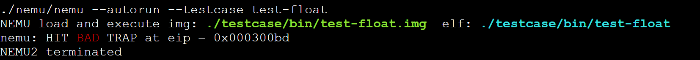

# PA 2-1 指令解码与执行——简单复杂的机器

在完成了基本的运算功能后，我们希望计算机能够按照我们的命令来执行各种运算。在这一阶段，我们就要赋予NEMU这样的能力。


## 代码实现
!!! info
    在这一阶段要实现较多的指令，需要通过除了`hello-inline`和`echo`以外的所有测试用例，基本的步骤为：

    1. 修改`Makefile`中`run`目标规则中的`<testcase_name>`，指定要执行的测试用例。或使用

    > make test_pa-2-1

    自动执行各个测试用例；

    2. 若遇到`invalide opcode`错误，则使用`./scripts/objdump4nemu-i386 –d testcase/bin/<testcase_name>`查看测试用例反汇编结果，看看到底是缺了哪条指令，查阅i386手册详细了解这条指令。实现这条指令并将其加入`opcode_entry[]`数组，替换对应位置上的`inv`指令
    * 框架代码已经提供了一部分指令的实现，只是没有填入`opcode_entry[]`，比如`mov.S`所需要的所有指令）；
    * `objdump4nemu-i386`是我们为NEMU定制的反汇编工具，随着框架代码一起发布，如果没有`objdump4nemu-i386`，可以使用自带`objdump`命令，但是对于NEMU定制的`0x82`指令的反汇编会出现错误，并且引起一系列的后续错误；

    重复上述过程，直至通过所有这一阶段要求的测试用例（见到传说中的**Hit Good Trap**），建议按照框架代码的默认顺序来执行测试用例。注意：`test-float`测试用例是唯一的一个例外，它理应**Hit Bad Trap**，请在实验报告中简述为什么。

    **注意：push imm8指令需要对立即数进行符号扩展，这一点在i386手册中没有说明，在IA-32手册中关于push指令有如下说明：  If the source operand  is an immediate and its size is less than the operand size, a sign-extended  value is pushed on the stack。**


!!! tip "关于指令实现的一个小提示"
    我们在实现指令时，可以参考框架代码中提供的指令参考```__ref_```，或许大部分时间你觉得指令实现十分顺利，但是如果你遇到一些奇怪的问题时，这是一个十分重要的调试手段

教程十分冗长，最简单的方法是仿照给出的几个指令实现——尽管这不很利于你完全理解全部细节。

一个重要的示例是实现了的`mov`指令，这给出了很大的参考
```C
static void instr_execute_2op() 
{
	operand_read(&opr_src);
	opr_dest.val = opr_src.val;
	operand_write(&opr_dest);
}

make_instr_impl_2op(mov, r, rm, b)
make_instr_impl_2op(mov, r, rm, v)
make_instr_impl_2op(mov, rm, r, b)
make_instr_impl_2op(mov, rm, r, v)
make_instr_impl_2op(mov, i, rm, b)
make_instr_impl_2op(mov, i, rm, v)
```
在这种形势下，我们注意到：我们在`instr_execute_2op`中形式化的给出了指令的目的，调用了`operand_read`和`operand_write`用于读取和写入操作数；而`make_instr_impl_2op`则给出了指令的源操作数和目的操作数，以及指令的类型（`r`、`rm`、`i`），在宏的良好定义下，我们只需要实现好`instr_execute_2op`。类似的指令还有`adc`, `add`, `and`, `bt`, `cbw`, `cmov`, `cmp`, `dec`, `inc`, `jcc`, 大多数的`mov`, `not`, `or`, `pop`, `push`, `sar`, `sbb`, `setcc`, `shl`, `shr`, `sub`, `test`, `xor`（仅供参考）。

仿照于此，我们给出一些指令的实现
```C
/* add */
static void instr_execute_2op(){
	operand_read(&opr_src);
	operand_read(&opr_dest);
	if(opr_src.data_size < data_size) opr_src.val = sign_ext(opr_src.val, opr_src.data_size);
	opr_dest.val = alu_add(opr_src.val, opr_dest.val, data_size);
	operand_write(&opr_dest);
}
make_instr_impl_2op(add, r, rm, b)
make_instr_impl_2op(add, r, rm, v)
make_instr_impl_2op(add, rm, r, b)
make_instr_impl_2op(add, rm, r, v)
make_instr_impl_2op(add, i, a, b)
make_instr_impl_2op(add, i, a, v)
make_instr_impl_2op(add, i, rm, b)
make_instr_impl_2op(add, i, rm, v)
make_instr_impl_2op(add, i, rm, bv)
```
```C
/* or */
static void instr_execute_2op(){
	operand_read(&opr_src);
	operand_read(&opr_dest);
	if(opr_src.data_size < data_size) opr_src.val = sign_ext(opr_src.val, opr_src.data_size);
	if(opr_dest.data_size < data_size) opr_dest.val = sign_ext(opr_dest.val, opr_dest.data_size);
	opr_dest.val = alu_or(opr_src.val, opr_dest.val, data_size);
	operand_write(&opr_dest);
}
make_instr_impl_2op(or, r, rm, b)
make_instr_impl_2op(or, r, rm, v)
make_instr_impl_2op(or, rm, r, b)
make_instr_impl_2op(or, rm, r, v)
make_instr_impl_2op(or, i, a, b)
make_instr_impl_2op(or, i, a, v)
make_instr_impl_2op(or, i, rm, b)
make_instr_impl_2op(or, i, rm, v)
make_instr_impl_2op(or, i, rm, bv)
```
其他指令的实现类似，不再赘述。

还有一种指令——`call`, `cltd`, `cmps`, `div`, `idiv`, `mul`, `imul`, `cld`, `clc`, `sahf`, `hlt`, `int`, `jmp`, `lea`, `leave`, `rep`, `ret`, `stos`, `x87`（仅供参考），这些指令不能借助于宏的定义实现，我们需要关心源操作数和目的操作数及其类型。

我们以`jmp`指令为参考如下：
```C
make_instr_func(jmp_near)
{
    OPERAND rel;
    rel.type = OPR_IMM;
    rel.sreg = SREG_CS;
    rel.data_size = data_size;
    rel.addr = eip + 1;
    operand_read(&rel);
    int offset = sign_ext(rel.val, data_size);
    print_asm_1("jmp", "", 1 + data_size / 8, &rel);
    cpu.eip += offset;
    return 1 + data_size / 8;
}
make_instr_func(jmp_short)
{
    OPERAND rel;
    rel.type = OPR_IMM;
    rel.sreg = SREG_CS;
    rel.data_size = 8;
    rel.addr = eip + 1;
    operand_read(&rel);
    int offset = sign_ext(rel.val, rel.data_size);
    print_asm_1("jmp", "", 1 + data_size / 8, &rel);
    cpu.eip += offset;
    return 1 + rel.data_size / 8;
}
make_instr_func(jmp_near_indirect)
{
    OPERAND rel;
    uint8_t opcode_temp = 0xff;
    rel.data_size = data_size;
    modrm_opcode_rm(cpu.eip+1 , &opcode_temp, &rel);
    operand_read(&rel);
    cpu.eip = rel.val;
    return 0;
}
make_instr_func(jmp_far_imm){
#ifdef IA32_SEG
    OPERAND r, rm;
    r.data_size = 32;
    rm.data_size = 16;
    r.type = OPR_IMM;
    r.sreg = SREG_CS;
    r.addr = eip + 1;
    rm.type = OPR_IMM;
    rm.sreg = SREG_CS;
    rm.addr = eip + 5;
    operand_read(&r);
    operand_read(&rm);
    cpu.cs.val = rm.val;
    load_sreg(SREG_CS);
    cpu.eip = r.val;
#endif
    return 0;
}
```
在`jmp`指令中，我们注意到，`jmp`指令的源操作数可以是立即数、寄存器、内存地址，因此我们需要根据不同的情况给出不同的实现。

这里我们尤其提到两个与栈相关的操作：`push`和`pop`，这两个指令在实现时常遇到问题，主要原因是对模拟栈与框架结构不很熟悉——我们需要强调，这部分相关内容很重要，对于一个程序这门课程需要你有能力画出对应的栈帧，而在模拟栈帧的方面，我们给出`push`和`pop`指令的参考实现如下：

```C
/* push */
static void instr_execute_1op(){
	operand_read(&opr_src);
	if(opr_src.data_size < data_size){
	   opr_src.val = sign_ext(opr_src.val, opr_src.data_size);
	   opr_src.data_size = data_size;
	} 
	switch(data_size){
	    case 16:
	        cpu.esp -= 2;
	        opr_src.addr = cpu.esp;
	        opr_src.sreg = SREG_SS;
	        opr_src.type = OPR_MEM;
	        break;
	    case 32:
	        cpu.esp -= 4;
	        opr_src.addr = cpu.esp;
	        opr_src.sreg = SREG_SS;
	        opr_src.type = OPR_MEM;
	        break;
	    default:
	        assert(0);
	        break;
	}
	operand_write(&opr_src);
}
make_instr_impl_1op(push, r, v)
make_instr_impl_1op(push, i, v)
make_instr_impl_1op(push, i, b)
make_instr_impl_1op(push, rm, v)
```
```C
/* pop */
static void instr_execute_1op(){
    switch(data_size){
	    case 16:
	        opr_dest.addr = cpu.esp;
	        opr_dest.sreg = SREG_SS;
	        opr_dest.type = OPR_MEM;
	        opr_dest.data_size = 16;
	        cpu.esp += 2;
	        break;
	    case 32:
	        opr_dest.addr = cpu.esp;
	        opr_dest.sreg = SREG_SS;
	        opr_dest.type = OPR_MEM;
	        opr_dest.data_size = 32;
	        cpu.esp += 4;
	        break;
	    default:
	        assert(0);
	        break;
	}
	operand_read(&opr_dest);
	opr_src.val = opr_dest.val;
	operand_write(&opr_src);
}
make_instr_impl_1op(pop, r, v)
```

!!! tip "选择你的道路"
    在本章的实验中，我们常见有两种不同的实现方式，你可以选择其中一种：

    第一种正如教程所说，逐级查看反汇编代码实现指令，这种实现方式可以让你感受到步步前进的乐趣，但是查看反汇编结果有时可能需要不少的时间；

    另一种更加暴力——直接使用`__ref_`覆盖`opcode`，理论上你可以通过所有测试用例并提示你引用了参考应该避免提交，然后逐步将`__ref_`替换为你的实现，但是你可能会因此实现一些本阶段暂时不必实现的指令，导致工程量的进一步增加。

## 思考习题
!!! question "PA2-1-1"
	使用hexdump命令查看测试用例的.img文件，所显示的.img文件的内容对应模拟内存的哪一个部分？指令在机器中表示的形式是什么？

使用hexdump命令查看测试用例的.img文件，所显示的.img文件的内容对应模拟内存的从0x30000开始的一段空间中，PA-2-1阶段框架代码直接将二进制.img文件拷贝到模拟内存作为测试样例，拷贝的具体实现过程如下：


指令在机器中是以二进制形式表示的，每条指令由一或多个字节组成，表示操作码（opcode）和操作数（operands）。根据冯·诺依曼结构，指令在形式上与数据没有区别。

!!! question "PA2-1-2"
	如果去掉instr_execute_2op()函数前面的static关键字会发生什么情况？为什么？

在此处static 关键字的作用是限制函数的可见性，使其只能在定义它的源文件中被访问
如果仅去掉一个instr_execute_2op()函数前面的static关键字，相关命令（如make test_pa-2-1）仍然能正常运行，这是因为编译时其他instr_execute_2op()函数都可以正确链接，而没有加static 关键字的函数为全局函数，由于其文件中没有重定义，也可以正确运行

如果去掉了两个及以上instr_execute_2op()函数前面的static关键字，执行结果如下:


由于在add和adc中均定义了同名的全局函数 instr_execute_2op，导致链接器在链接过程中报重定义错误

!!! question "PA2-1-3"
	为什么test-float会fail？以后在写和浮点数相关的程序的时候要注意什么？

在testcase目录下运用反汇编工具执行如下命令./objdump4nemu-i386 -d bin/test-float可以得到如下结果
```o
00030000 <start>:
   30000:       e9 00 00 00 00          jmp    30005 <main>

00030005 <main>:
   30005:       55                      push   %ebp
   30006:       89 e5                   mov    %esp,%ebp
   30008:       83 e4 f8                and    $0xfffffff8,%esp
   3000b:       83 ec 10                sub    $0x10,%esp
   3000e:       d9 05 00 10 03 00       flds   0x31000
   30014:       d9 5c 24 0c             fstps  0xc(%esp)
   30018:       d9 e8                   fld1   
   3001a:       d9 5c 24 08             fstps  0x8(%esp)
   3001e:       d9 44 24 0c             flds   0xc(%esp)
   30022:       d8 44 24 08             fadds  0x8(%esp)
   30026:       d9 5c 24 04             fstps  0x4(%esp)
   3002a:       dd 05 08 10 03 00       fldl   0x31008
   30030:       d9 44 24 04             flds   0x4(%esp)
   30034:       da e9                   fucompp 
   30036:       df e0                   fnstsw %ax
   30038:       80 e4 45                and    $0x45,%ah
   3003b:       80 fc 40                cmp    $0x40,%ah
   3003e:       74 06                   je     30046 <main+0x41>
   30040:       b8 01 00 00 00          mov    $0x1,%eax
   30045:       82                      nemu_trap 
   30046:       d9 44 24 0c             flds   0xc(%esp)
   3004a:       d8 4c 24 08             fmuls  0x8(%esp)
   3004e:       d9 5c 24 04             fstps  0x4(%esp)
   30052:       dd 05 10 10 03 00       fldl   0x31010
   30058:       d9 44 24 04             flds   0x4(%esp)
   3005c:       da e9                   fucompp 
   3005e:       df e0                   fnstsw %ax
   30060:       80 e4 45                and    $0x45,%ah
   30063:       80 fc 40                cmp    $0x40,%ah
   30066:       74 06                   je     3006e <main+0x69>
   30068:       b8 01 00 00 00          mov    $0x1,%eax
   3006d:       82                      nemu_trap 
   3006e:       d9 44 24 0c             flds   0xc(%esp)
   30072:       d8 74 24 08             fdivs  0x8(%esp)
   30076:       d9 5c 24 04             fstps  0x4(%esp)
   3007a:       dd 05 10 10 03 00       fldl   0x31010
   30080:       d9 44 24 04             flds   0x4(%esp)
   30084:       da e9                   fucompp 
   30086:       df e0                   fnstsw %ax
   30088:       80 e4 45                and    $0x45,%ah
   3008b:       80 fc 40                cmp    $0x40,%ah
   3008e:       74 06                   je     30096 <main+0x91>
   30090:       b8 01 00 00 00          mov    $0x1,%eax
   30095:       82                      nemu_trap 
   30096:       d9 44 24 0c             flds   0xc(%esp)
   3009a:       d8 64 24 08             fsubs  0x8(%esp)
   3009e:       d9 5c 24 04             fstps  0x4(%esp)
   300a2:       dd 05 18 10 03 00       fldl   0x31018
   300a8:       d9 44 24 04             flds   0x4(%esp)
   300ac:       da e9                   fucompp 
   300ae:       df e0                   fnstsw %ax
   300b0:       80 e4 45                and    $0x45,%ah
   300b3:       80 fc 40                cmp    $0x40,%ah
   300b6:       74 06                   je     300be <main+0xb9>
   300b8:       b8 01 00 00 00          mov    $0x1,%eax
   300bd:       82                      nemu_trap 
   300be:       b8 00 00 00 00          mov    $0x0,%eax
   300c3:       82                      nemu_trap 
   300c4:       b8 00 00 00 00          mov    $0x0,%eax
   300c9:       c9                      leave  
   300ca:       c3                      ret
```
运行test_pa-2-1的结果得到


在指令的实现中对于cmp等指令均使用了alu.c的实现，即整数的运算；对浮点数类型应该采用fpu.c中实现的运算，否则就会得到错误的结果，启示我们以后在写与浮点数相关的程序时，需要注意使用正确的指令（实现浮点数运算的指令，在nemu中x87_f...下，如此处cmp最好调用x87_fucomp进行浮点数的比较）
这一比较的错误原因还在于二进制表示浮点数时，由于机器所能表示的浮点数并非连续，其对于一些浮点数会有所舍入，使两个浮点数相加后的结果与直接将结果赋值给一浮点数两者有一定差别。因此，对于浮点数a, b进行比较时，常采用a-e < b < a+e（其中e为一个很小的正数）即认为a == b，这也是使用alu.c中的alu_cmp会得到错误结果的原因

!!! success "PA2-1阶段结束"
	寒山鸣钟，声声苦乐皆随风

	拾得落红，叶叶来去都从容