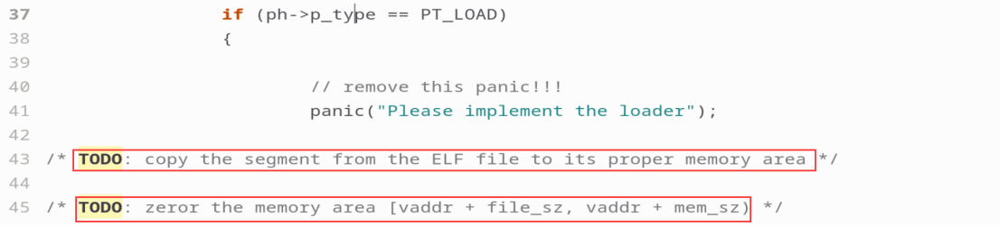

# PA 2-2 装载ELF文件——Linux中的文件

在上一节中所展开的实现指令的实验中，测试用例的可执行目标文件是通过交叉编译并使用`objcopy`直接得到对应的内存镜像加载到内存中执行的。在真实的计算机系统中，这是一种效率极低的存储可执行文件的方法。现代的类UNIX操作系统，如Linux，主要使用可执行可链接格式（Executable and Linkable Format，简称ELF）来存储目标文件。本节我们就目标文件的装载展开讨论。


## 代码实现
!!! info "ELF文件的装载"
    1. 修改`testcase/Makefile`中`LDFLAGS`并

    > make clean

    2. 实现Kernel中的`loader()`；

    3. 使用`make test_pa-2-2`执行测试用例并通过。
   
在经历了PA2-1的大量指令的解析与实现后，PA2-2的工程量是相对较小的，但是理论知识相对更为重要一些。

正如在视窗(Windows)系统下的可执行文件后缀名为.exe，现代的类UNIX操作系统，如Linux，主要使用可执行可链接格式（Executable and Linkable Format，简称ELF）来存储目标文件。

从完成实验的角度，本小节主要任务有两个。首先是修改位于testcase/Makefile的起始地址，其中第7行0x30000被用于PA-2-1的测试，我们需要将其更改为第二行的表示，即将起始地址更改为0x100000。


其次，还需要实现kernel/src/elf/elf.c中的代码实现loader函数，这个函数的伪代码已经在课程中指出了，在elf.c代码的第43、45行也有Todo操作的提示，对照来看，我们需要实现的是伪代码第5行至第7行的操作。




通过 man elf可以查看ELF头的结构，其中包括了我们实现loader函数所需要使用的Offset、FileSiz等基本信息。执行结果如下


依据上述内容，`elf_load()`函数的实现相对简单。正如 `Todo`所指出的，具体地，我们首先需要获取ELF文件中对应段的起始地址，然后通过`memcpy()`函数将对应段的内容拷贝到内存中。如果段的大小大于文件大小，则需要将剩余的段置零。

```C
void* target = (void*)ph->p_vaddr;
uint8_t* start = (uint8_t*)elf + ph->p_offset;
memcpy(target, start, ph->p_filesz);
if(ph->p_memsz > ph->p_filesz){
    target = (void*)ph->p_vaddr + ph->p_filesz;
    size_t size = ph->p_memsz - ph->p_filesz;
    memset(target, 0, size);
}
```

接着，我们使用`make test_pa-2-2`执行测试用例并通过，标志着PA2-2阶段代码模拟部分结束。

## 思考习题
!!! question "PA2-2"
    为什么在装载时要把内存中剩余的p_memsz - p_filesz字节的内容清零?

根据预备理论知识，容易知道程序头表中每一项的结构可以通过man elf命令进行查看如下：
```C
typedef struct {
    uint32_t   p_type;
    Elf32_Off  p_offset;
    Elf32_Addr p_vaddr;
    Elf32_Addr p_paddr;
    uint32_t   p_filesz;
    uint32_t   p_memsz;
    uint32_t   p_flags;
    uint32_t   p_align;
} Elf32_Phdr;
```
对于p_type == PT_LOAD的表项，将ELF文件中起始于p_offset，大小为p_filesz字节的数据拷贝到内存中起始于p_vaddr的位置并将内存中剩余的p_memsz - p_filesz字节的内容清零。
p_memsz指定了在内存中占据的大小，p_filesz指定了在文件中实际的大小。如果p_memsz大于p_filesz，这表明内存中分配的空间超过了文件中实际的大小，这部分需要被初始化为0以防止可能的未期望行为导致出错。

!!! success "PA2-2阶段结束"
    擦干眼泪对着鸡零狗碎的日子  一笑了之    ——《天真的橡皮》