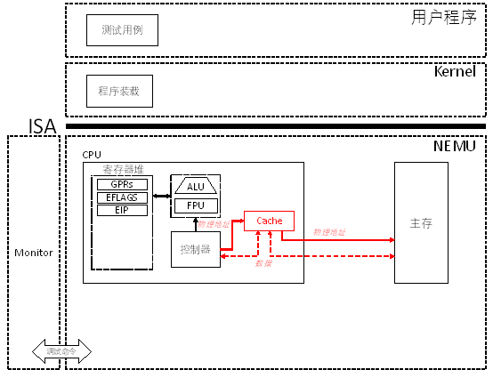

# PA 3-1 高速缓存的模拟——更快访问的追求

CPU的每次访存都需要进过一系列的信号转换，最后到一个速度受限的DRAM上去完成数据的存取。由于每一条指令的执行都至少需要进行一次访存。如果不采取有效措施，那么系统速度就会卡在DRAM这一个瓶颈上，CPU造的再快也没有效果。那如何提高访存的效率呢？我们可以自然地想到从两个地方着手：

!!! note "高速缓存"
    1. 采用比DRAM更快的器件，于是我们想到采用无需刷新的静态随机存取存储器（Static Random Access Memory，SRAM）来代替DRAM；

    2. 让存储部件离CPU更近一点，我们把SRAM直接放到CPU的芯片里面。

事实表明，这是一种很成功的做法，能够使这一部分SRAM的存取速度相比DRAM提高十几甚至上百倍，CPU能够在几个时钟周期内就完成对SRAM数据的访问。我们将这一部分造在CPU中的SRAM称为高速缓存（Cache）。



!!! info "实现Cache"
    在`include/config.h`中定义宏`CACHE_ENABLED`并`make clean`； 
    在NEMU中实现一个cache，它的性质如下:

    1. cache block存储空间的大小为64B

    2. cache存储空间的大小为64KB

    3. 8-way set associative

    4. 标志位只需要valid bit即可

    5. 替换算法采用随机方式

    6. write through

    7. not write allocate

    你还需要在`nemu/src/memory/memory.c`的`init_mem()`函数中对cache进行初始化，将所有valid bit置为无效即可。实现后，修改`memory.c`中的`paddr_read()`和`paddr_write()`函数，让它们读写cache，当缺失时由cache负责调用`hw_mem_read()`和`hw_mem_write()`读写DRAM。

其实`cache`是PA阶段相对独立的一部分，如果维护良好，开关cache可以得到`NEMU`相同的运行效果。值得一提的是，`NEMU`的`cache`并不提高程序执行的速度，反而会降低程序执行的速度。

在`nemu/include/memory/mmu/cache.h`中给出了Cacheline结构之基本定义如下
```c
typedef struct Cacheline{
    uint8_t valid_bit;
    uint32_t tag;
    uint8_t data[64];
} CacheLine;
```
其中`valid_bit`为有效位，`tag`为标记位，`data`为数据位。
从`cache`的存储空间大小为64KB，`cache`的block存储空间大小为64B，所以`cache`的`set`个数为64KB/64B=1024，`cache`的`way`个数为8，所以`cache`的`index`个数为1024/8=128，`cache`的`offset`个数为64/8=8。
在`nemu/src/memory/mmu/cache.c`中`cache`的初始化函数`init_cache()`如下
```c
#ifdef CACHE_ENABLED
CacheLine cache[1024];
void init_cache()
{
	for(int i = 0; i < 1024; i ++){
	    cache[i].valid_bit = 0;
	}
}
```

接下来，我们需要实现`cache`及其`read`和`write`函数，注意需要符合要求，并在开启`cache`时调用`cache`的`read`和`write`函数通过测试样例。

!!! success "PA 3-1阶段结束"
    我不问弱水三千几人能为我怨

    轮回百转

    只求陪你续前缘