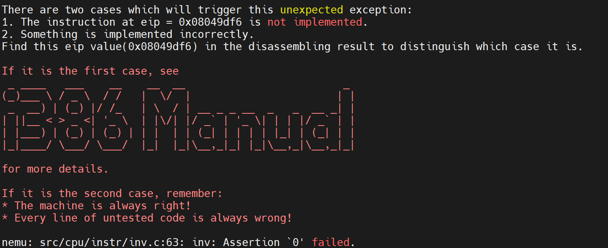
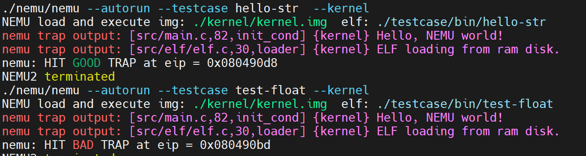

# PA 3-2 保护模式（分段机制）——虚实交错的魔法

在之前的阶段中，NEMU始终工作在类似于“实模式”的状态下，简言之，就是程序直接通过物理地址访问主存。从本小节开始，我们开始让NEMU具备现代计算机的内存管理功能。


!!! info "分段机制的实现"
    1. 在`include/config.h`头文件中添加宏定义`IA32_SEG`并`make clean`；

    2. 在`CPU_STATE`中添加对`GDTR`、`CR0`的模拟以及在`init_cpu()`中进行初始化为0；

    3. 在`CPU_STATE`中添加对6个段寄存器的模拟在`init_cpu()`中进行初始化为0，注意除了要模拟其16位的可见部分，还要模拟其隐藏部分，顺序不能有错；

    4. 实现包括`lgdt`、针对控制寄存器和段寄存器的特殊`mov`以及`ljmp`指令；

    5. 实现`segment_translate()`、`loag_sreg()`函数，并在`vaddr_read()`和`vaddr_write()`函数中添加保护模式下的虚拟地址向线性地址转换的过程；

在PA3各个阶段中，工程代码量偏小，理解十分重要。这也是x86模拟与RISC-V模拟PA任务的一个重要区别。

!!! tip "分段机制"
	当开启保护模式后，NEMU中运行的程序访在问内存时给出的就不简单是32位的物理地址了，而是由一个16位的段选择符加上32位的段内偏移量（有效地址）所构成的48位的逻辑地址（或称虚拟地址）。由于32位的段内偏移量是由程序直接给出，那唯一的问题就是如何通过16位的段选择符来获取32位的段基地址（`base address`）。在80386中，这一过程通过查表来实现。计算机与操作系统约定，若要开启保护模式，则操作系统需要事先在内存中准备好一个表，叫做“段表”，其中存储好每个段的首地址（`base address`）、段的长度（`limit`）等相关的信息。段表由一系列连续的段表项构成，其中每个段表项都是一个64位的数据结构称为段描述符，其结构如下：

	```
	DESCRIPTORS USED FOR APPLICATIONS CODE AND DATA SEGMENTS

	31                23                15                7               0
	+-----------------+-+-+-+-+---------+-+-----+-+-----+-+-----------------+
	|                 | | | |A|         | |     | |     | |                 |
	|   BASE 31..24   |G|X|O|V| LIMIT   |P| DPL |1| TYPE|A|  BASE 23..16    | 4
	|                 | | | |L| 19..16  | |     | |     | |                 |
	|-----------------+-+-+-+-+---------+-+-----+-+-----+-+-----------------|
	|                                   |                                   |
	|        SEGMENT BASE 15..0         |       SEGMENT LIMIT 15..0         | 0
	|                                   |                                   |
	+-----------------------------------+-----------------------------------+

			A      - ACCESSED
			AVL    - AVAILABLE FOR USE BY SYSTEMS PROGRAMMERS
			DPL    - DESCRIPTOR PRIVILEGE LEVEL
			G      - GRANULARITY
			P      - SEGMENT PRESENT

	64位段描述符结构
	```

	于是整个段表就是多个段表项构成的一个数组：

	```
	+----------------+
	|    SEGMENT     |
	|   DESCRIPTOR   |
	+----------------+
	|    SEGMENT     |
	|   DESCRIPTOR   |
	+----------------+
	|                |
	|                |
	|                |
	|       ...      |
	|                |
	|                |
	+----------------+
	|    SEGMENT     |
	|   DESCRIPTOR   |
	+----------------+

	段表
	```

	在48位的逻辑地址中，包含了16位的段选择符，一个段选择符的结构如下：

	```
	15                        3 2   0
	+-------------------------+-+---+
	|                         |T|   |
	|           INDEX         | |RPL|
	|                         |I|   |
	+-------------------------+-+---+

	TI  - TABLE INDICATOR
	RPL - REQUESTOR'S PRIVILEGE LEVEL

	16位段选择符结构
	```

	如上图所示的段选择符存储在段寄存器的可见部分，由三个部分组成：高13位是一个`index`，用于指出所访问段的段描述符是段表中的第几项（数组下标）；`TI`用于指出选择哪一个段描述符表，`TI`为0时表示选择全局描述符表（GDT），`TI`为1时表示选择局部描述符表（LDT），在NEMU中，我们只关注GDT；最后`RPL`则与访问权限控制有关。

首先，我们需要先实现对```GDTR```、```CR0```的模拟。其中```GDTR```是全局描述符表寄存器，```CR0```是控制寄存器。
```c
typedef struct{
	uint32_t limit :16;
	uint32_t base :32;
}GDTR;

#ifdef IA32_SEG
	GDTR gdtr;
	union {
		SegReg segReg[6];
		struct{
			SegReg es, cs, ss, ds, fs, gs;
		};
	};
	CR0 cr0;
#else
```
在`init_cpu()`中进行初始化，对`GDTR`、`CR0`和6个段寄存器的可见部分进行初始化为0，也需要注意隐藏部分。
```c
#ifdef IA32_SEG
	cpu.cr0.val = 0x0;
	cpu.gdtr.base = cpu.gdtr.limit = 0x0;
	for (i = 0; i < 6; i++){
		cpu.segReg[i].val = 0x0;
	}
#endif
```

接下来，我们实现```lgdt```、针对控制寄存器和段寄存器的特殊```mov```以及```ljmp```指令。这些指令的实现请参考```i386```手册，这里不再赘述。

!!! tip "关于指令实现的一个小提示"
	我们在每次遇到指令需要实现时，都会放上这样一个小提示框。
    我们在实现指令时，可以参考框架代码中提供的指令参考```__ref_```，或许大部分时间你觉得指令实现十分顺利，但是如果你遇到一些奇怪的问题时，这是一个十分重要的调试手段



通过我们引用的理论知识部分，实现```segment_translate()```是相对显而易见的：

```C
uint32_t segment_translate(uint32_t offset, uint8_t sreg)
{
	return cpu.segReg[sreg].base + offset;
}
```


在`nemu/include/memory/mmu/segment.h`中，我们定义了段描述符的结构体，其结构如下：
```c
typedef union SegmentDescriptor {
	struct
	{
		uint32_t limit_15_0 : 16;
		uint32_t base_15_0 : 16;
		uint32_t base_23_16 : 8;
		uint32_t type : 4;
		uint32_t segment_type : 1;
		uint32_t privilege_level : 2;
		uint32_t present : 1;
		uint32_t limit_19_16 : 4;
		uint32_t soft_use : 1;
		uint32_t operation_size : 1;
		uint32_t pad0 : 1;
		uint32_t granularity : 1;
		uint32_t base_31_24 : 8;
	};
	uint32_t val[2];
} SegDesc;
```
结合其描述，我们可以给出如下的实现
```C
void load_sreg(uint8_t sreg)
{
	SegDesc temp_seg;
	assert(cpu.segReg[sreg].ti == 0);
	if(cpu.segReg[sreg].ti == 0){
	    temp_seg.val[0] = laddr_read(cpu.gdtr.base + (cpu.segReg[sreg].index << 3), 4);
	    temp_seg.val[1] = laddr_read(cpu.gdtr.base + (cpu.segReg[sreg].index << 3) + 4, 4);
	}else{
	    temp_seg.val[0] = laddr_read((cpu.segReg[sreg].index << 3), 4);
	    temp_seg.val[1] = laddr_read((cpu.segReg[sreg].index << 3) + 4, 4);
	}    
	cpu.segReg[sreg].base = ((temp_seg.base_23_16 & 0xFF) << 16) + ((temp_seg.base_31_24 & 0xFF) << 24) + (temp_seg.base_15_0 & 0xFFFF);
	cpu.segReg[sreg].limit = ((temp_seg.limit_19_16  & 0xF) << 16) + (temp_seg.limit_15_0 & 0xFFFF);
	cpu.segReg[sreg].type = (temp_seg.segment_type << 4) + temp_seg.type;
	cpu.segReg[sreg].privilege_level = temp_seg.privilege_level  & 0x3;
	cpu.segReg[sreg].soft_use = temp_seg.soft_use & 0x1;

	assert(cpu.segReg[sreg].base == 0);
}
```
事实上，在NEMU中我们只关心了GDT，因此`assert(cpu.segReg[sreg].ti == 0)`总可以通过。而`if-else`语句则对处理LDT留下了空间，展示我们对于代码扩展性的关注与对`i386`的尊重。

在完成上述实现后，确保开启`#define IA32_SEG`并在工程目录下运行```make test_pa-3-2```，观察到如下结果：



这标志我们顺利通过了PA3-2的代码模拟部分。

## 思考习题

!!! question "PA3-2-1"
	NEMU在什么时候进入了保护模式？
根据PPT内容，x86的机器开机后首先进入实模式加载操作系统，操作系统初始化段表，拨动一个“开关”，从实模式切换到保护模式（开启分段机制），且PPT中给出了kernel/start/start.S中的部分内容如下
```Am
	start_cond:
	# Set up the protected-mode data segment registers
		movw    $GDT_ENTRY(2), %ax
		movw    %ax, %ds          # %DS = %AX
		…
	# Enable protection
		movl    %cr0, %eax        # %CR0 |= PROTECT_ENABLE_BIT
		orl     $0x1, %eax
		movl    %eax, %cr0

```
在这里修改CR0寄存器，启用了保护模式。

!!! question "PA3-2-2"
	在GDTR中保存的段表首地址是虚拟地址、线性地址、还是物理地址？为什么？

在GDTR（全局描述符表寄存器）中保存的段表首地址是线性地址。根据《计算机系统基础》第303-304页的内容，通过段选择符内13位索引值找到对应的段描述符；每个段描述符占8个字节，位移索引值乘以8加上描述符表首地址确定选中的段描述符的地址，从中取出32位基地址与逻辑地址中32位的段内偏移量相加得到32位线性地址。因此可以推知在GDTR（全局描述符表寄存器）中保存的段表首地址是线性地址。

!!! quote "PA3-2的特殊性"
	在PA3-2中，我们实现了对分段机制的模拟，但是并没有实现分页机制。这导致了一个很显著的差异——现阶段线性地址就等于物理地址（`physical address`）。因此，在PA3-2中，将`laddr_read`和``laddr_write``的函数调用改为`paddr_read`和``paddr_write``也可以通过测试，但这是不对的，并会在PA3-3中导致段错误。

!!! success "PA-3-2阶段结束"
    厚重中显出轻灵，执着中显出超脱，命运的铁的法则中显出恍恍惚惚的朦胧。——王蒙《<红楼梦>启示录》