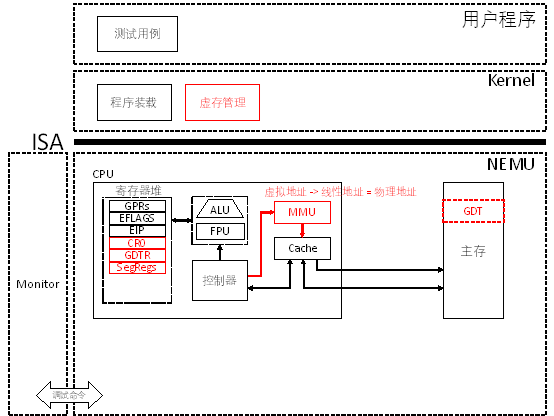

# PA 3-2 保护模式（分段机制）——虚实交错的魔法

在之前的阶段中，NEMU始终工作在类似于“实模式”的状态下，简言之，就是程序直接通过物理地址访问主存。从本小节开始，我们开始让NEMU具备现代计算机的内存管理功能。


!!! info "分段机制的实现"
    1. 在`include/config.h`头文件中添加宏定义`IA32_SEG`并`make clean`；

    2. 在`CPU_STATE`中添加对`GDTR`、`CR0`的模拟以及在`init_cpu()`中进行初始化为0；

    3. 在`CPU_STATE`中添加对6个段寄存器的模拟在`init_cpu()`中进行初始化为0，注意除了要模拟其16位的可见部分，还要模拟其隐藏部分，顺序不能有错；

    4. 实现包括`lgdt`、针对控制寄存器和段寄存器的特殊`mov`以及`ljmp`指令；

    5. 实现`segment_translate()`、`loag_sreg()`函数，并在`vaddr_read()`和`vaddr_write()`函数中添加保护模式下的虚拟地址向线性地址转换的过程；
   
首先，我们需要先实现对```GDTR```、```CR0```的模拟。其中```GDTR```是全局描述符表寄存器，```CR0```是控制寄存器。
```c
typedef struct{
	uint32_t limit :16;
	uint32_t base :32;
}GDTR;

#ifdef IA32_SEG
	GDTR gdtr;
	union {
		SegReg segReg[6];
		struct{
			SegReg es, cs, ss, ds, fs, gs;
		};
	};
	CR0 cr0;
#else
```
在`init_cpu()`中进行初始化，对`GDTR`、`CR0`和6个段寄存器的可见部分进行初始化为0，也需要注意隐藏部分。
```c
#ifdef IA32_SEG
	cpu.cr0.val = 0x0;
	cpu.gdtr.base = cpu.gdtr.limit = 0x0;
	for (i = 0; i < 6; i++){
		cpu.segReg[i].val = 0x0;
	}
#endif
```