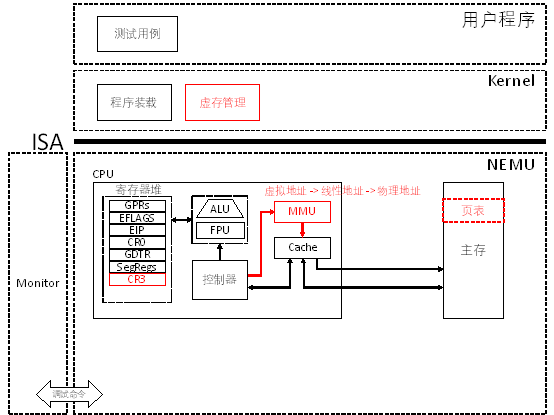
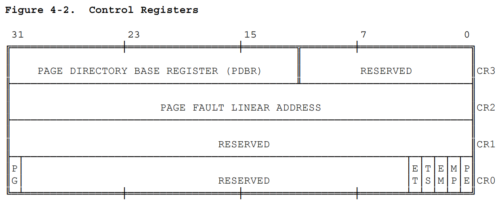
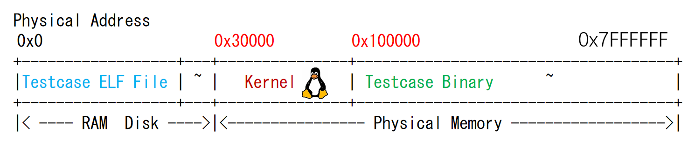
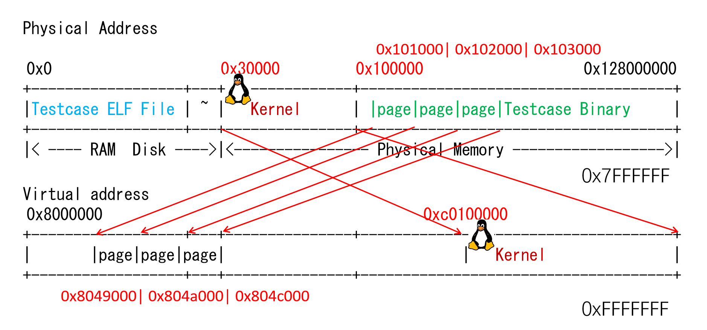

# PA 3-3 分页机制——超越容量的界限

在上一节中，我们实现从逻辑地址到线性地址的转换。在实现分页机制之前，线性地址就当做物理地址使用。而自从80386开始，计算机又提供了一种全新的存储管理方式，那就是分页机制。在分页机制下，每一个进程都拥有独立的存储空间。同时，每一个进程独立的存储空间又具有相同的地址划分方式。此时，线性地址就需要通过进一步的转换，才能获得最终要访问的物理地址。



## 代码实现

!!! info "分页机制的模拟"
    1. 修改Kernel和testcase中`Makefile`的链接选项

    2. 在`include/config.h`头文件中定义宏`IA32_PAGE`并`make clean`

    3. 在`CPU_STATE`中添加`CR3`寄存器

    4. 修改`laddr_read()`和`laddr_write()`，适时调用`page_translate()`函数进行地址翻译

    5. 修改Kernel的`loader()`，使用`mm_malloc`来完成对用户进程空间的分配

首先需要处理的是在`CPU_STATE`中添加`CR3`寄存器，这需要我们查阅i386手册，与前述CR0一致的，我们可以找到这样的描述

由此也可以写出`CR3`的结构模拟
```c
typedef union {
	struct {
		uint32_t reserve :12;
		uint32_t pdbr :20;
	};
	uint32_t val; 	
} CR3;
```
!!! tip "PA3-3的一个小提示"
    在本节的```page_translate()```函数中，我们发现当```#define TLB_ENABLED```时，框架代码给出了TLB查询的实现。因此在继续进行PA3-3时，我们可以先设置```#define TLB_ENABLED```，然后进行laddr_read和laddr_write的实现，最后再取消```#define TLB_ENABLED```并实现```page_translate()```函数。

!!! danger "一个需要注意的地方"
    laddr_read()和laddr_write()的行为也要发生改变：当CR0的PG位被置为1时，需要按照上一小节中所述的方法，查询两级页表，将线性地址转换成物理地址再加以访问。注意在laddr_read()和laddr_write()中要处理地址访问跨越页边界的情形，若发生跨越页边界，则应当将一次读写拆分成两次物理地址读写来进行。

事实上，`laddr_read()`和`laddr_write()`的修改在逻辑上并不难，其重点在上述任务描述中已经十分详细。一个参考实现如下
```C
uint32_t laddr_read(laddr_t laddr, size_t len)
{
    assert(len == 1 || len == 2 || len == 4);
#ifdef IA32_PAGE
    if(cpu.cr0.pg == 1 && cpu.cr0.pe == 1) //当CR0的PG位被置为1时，需要查询两级页表，将线性地址转换成物理地址再访问
    {
        if(laddr + len - 1 > (laddr | 0xFFF)) //在x86系统中规定每个页面的大小为4KB，若大于，则需要分两次访问
        {
            paddr_t paddr_low = page_translate(laddr), paddr_high = page_translate((laddr & 0xFFFFF000) + 0x1000);
            size_t len_low = (laddr | 0xFFF) - laddr + 1, len_high = len - len_low;
            assert(len_high == (laddr + len - 1) - (laddr | 0xFFF));
            uint32_t data_low = paddr_read(paddr_low, len_low), data_high = paddr_read(paddr_high, len_high);
            uint32_t res = (data_low) | (data_high << (8 * len_low));
            return res;
        }
        else{
            paddr_t paddr = page_translate(laddr);
            return paddr_read(paddr, len);
        }
    }
    else{
        return paddr_read(laddr, len);
    }
#else
    return paddr_read(laddr, len);
#endif
}

void laddr_write(laddr_t laddr, size_t len, uint32_t data)
{
    assert(len == 1 || len == 2 || len == 4);	
#ifdef IA32_PAGE
    if(cpu.cr0.pg == 1 && cpu.cr0.pe == 1) //当CR0的PG位被置为1时，需要查询两级页表，将线性地址转换成物理地址再访问
    {
        if(laddr + len - 1 > (laddr | 0xFFF)) //在x86系统中规定每个页面的大小为4KB，若大于，则需要分两次访问
        {
            paddr_t paddr_low = page_translate(laddr), paddr_high = page_translate((laddr & 0xFFFFF000) + 0x1000);
            size_t len_low = (laddr | 0xFFF) - laddr + 1, len_high = len - len_low;
            assert(len_high == (laddr + len - 1) - (laddr | 0xFFF));
            uint32_t data_low = data & (0xFFFFFFFF >> (8 * len_high)), data_high = data >> (8 * len_low);
            paddr_write(paddr_low, len_low, data_low);
            paddr_write(paddr_high, len_high, data_high);
        }
        else{
            paddr_t paddr = page_translate(laddr);
            paddr_write(paddr, len, data);
        }
    }
    else{
        paddr_write(laddr, len, data);
    }
#else
    paddr_write(laddr, len, data);
#endif
}
```

!!! example "一个投机取巧的实现"
    你不难注意到，这样实现也可以通过所有的测试样例，但是，这并不是一个好的实现。
    ```C
    uint32_t laddr_read(laddr_t laddr, size_t len){
        assert(len == 1 || len == 2 || len == 4);
        if( cpu.cr0.pg == 1) {
            paddr_t paddr = page_translate(laddr);
	        return paddr_read(paddr, len);
        } else return paddr_read(laddr, len);
    }
    void laddr_write(laddr_t laddr, size_t len, uint32_t data){
	    assert(len == 1 || len == 2 || len == 4);
        if( cpu.cr0.pg == 1) {
            paddr_t paddr = page_translate(laddr);
	        paddr_write(paddr, len, data);
        } else  paddr_write(laddr, len, data);
    }
    ```

!!! bug "一个错误的实现"
    ```
    void laddr_write(laddr_t laddr, size_t len, uint32_t data){
	    assert(len == 1 || len == 2 || len == 4);
	    if( cpu.cr0.pg == 1) {
		    if (laddr + len - 1 > (laddr|0xFFF)) {
			    paddr_t paddr = page_translate(laddr);
			    paddr_write(paddr, (laddr|0xFFF) - laddr + 1, data & (0xFFFFFFFF >> (8 * (laddr|0xFFF) - laddr + 1)));
			    paddr = page_translate((laddr|0xFFF) + 1);
			    paddr_write(paddr, len - (((laddr|0xFFF) - laddr + 1)), data >> (8 * ((laddr|0xFFF) - laddr + 1)));
		}   else{
			    paddr_t paddr = page_translate(laddr);
			    paddr_write(paddr, len, data);	
		    }
	    }else{
	        paddr_write(laddr, len, data);
	    }
    }
    ```
    隐蔽的错误：看起来似乎没有太大问题，但是事实上在```laddr_write```函数的实现中对```data```的运算出现了一点点失误，导致了诡异的情况。

!!! question "为什么我在这里给出了我曾经错误的实现"
    我曾经想，作为一份看起来很正式的学习记录，不应该出现错误或误导。但是，我后来发现，这并不是一个好的学习记录。本记录的写作之初心是记录学习过程，而不是记录学习成果。因此，我决定在错误的地方加上注释，以提醒自己，也提醒后来者。正如我的一个同学说的
    > 那不是黑历史 那是来时路

接下来，我们实现`page_translate()`函数。事实上，我们可以通过先开启```#define TLB_ENABLED```，并将自己的实现与TLB的结果通过```assert```进行比较，从而发现可能存在的问题。

```
         31        22 21       12 11           0
LINEAR  +------------+-----------+--------------+
ADDRESS |    DIR     |    PAGE   |   OFFSET     |
        +------------+-----------+--------------+
        
32位线性地址结构
```
```
                                                              PAGE FRAME
              +-----------+-----------+----------+         +---------------+
              |    DIR    |   PAGE    |  OFFSET  |         |               |
              +-----+-----+-----+-----+-----+----+         |               |
                    |           |           |              |               |
      +-------------+           |           +------------->|    PHYSICAL   |
      |                         |                          |    ADDRESS    |
      |   PAGE DIRECTORY        |      PAGE TABLE          |               |
      |  +---------------+      |   +---------------+      |               |
      |  |               |      |   |               |      +---------------+
      |  |               |      |   |---------------|              ^
      |  |               |      +-->| PG TBL ENTRY  |--------------+
      |  |---------------|          |---------------|
      +->|   DIR ENTRY   |--+       |               |
         |---------------|  |       |               |
         |               |  |       |               |
         +---------------+  |       +---------------+
                 ^          |               ^
+-------+        |          +---------------+
|  CR3  |--------+
+-------+

图3-11线性地址向物理地址转换的过程
```
我们给出一个有些抽象、不很优雅的实现——尽管如此，这是我在PA3-3中给出的实现。
```C
paddr_t page_translate(laddr_t laddr)
{
#ifndef TLB_ENABLED
	uint32_t high_10_ = (laddr >> 22) & 0x3FF;
	uint32_t mid_10_ = (laddr >> 12) & 0x3FF;
	uint32_t low_12_ = laddr & 0xFFF;
	uint32_t temp_p_PDBE = (cpu.cr3.PDBR) << 12;
	uint32_t temp_1 = paddr_read(temp_p_PDBE + (high_10_ << 2), 4);
	assert(temp_1 & 0x1);
	temp_1 = temp_1 & 0xFFFFF000;
	temp_1 = paddr_read(temp_1 + (mid_10_ << 2), 4);
	assert(temp_1 & 0x1);
	uint32_t temp_paddr = (temp_1 & 0xFFFFF000) | low_12_;
	return temp_paddr;
#else
	return tlb_read(laddr) | (laddr & PAGE_MASK);
#endif
}
```

我们直观通过预编译的形式展示Kernel的`loader()`的变化如下
```C
#ifdef IA32_PAGE
            uint32_t paddr = mm_malloc(ph->p_vaddr, ph->p_memsz);
#else
            uint32_t paddr = ph->p_vaddr;
#endif
```

在完成上述实现后，确保开启`#define IA32_PAGE`以及关闭`#define TLB_ENABLED`并在工程目录下运行```make test_pa-3-3```，观察到如下结果：


这标志我们顺利通过了PA3-3的代码模拟部分。

## 思考习题

!!! question "PA3-3-1"
    Kernel的虚拟页和物理页的映射关系是什么？请画图说明；
在32位x86系统中，Kernel会将自己的一部分内存映射到所有进程的虚拟地址空间的0xc0030000及以上。这点在“将输入的虚拟地址减去KOFFSET=0xc0000000，从而转换成物理地址。”有体现

从0x30000开始的Kernel对应了0xc0030000开始的虚拟地址，相应的Kernel的虚拟页和物理页也是一个位于0x30000-0x100000，一个位于0xc0030000-0xc0100000，一个大致的映射如下：
```P

|                                    \
|                                      \
|                                        \
+----------------------------------------------+
|                      |      |                 |
|                      | 页表 |    页            |
|                      |      |                 |
+----------------------------------------------+
Kernel
物理地址0x30000
虚拟地址0xc0030000
```

!!! question "PA3-3-2"
    以某一个测试用例为例，画图说明用户进程的虚拟页和物理页间映射关系又是怎样的？Kernel映射为哪一段？你可以在loader()中通过Log()输出mm_malloc的结果来查看映射关系，并结合init_mm()中的代码绘出内核映射关系。
在加载器(loader())为该测试用例创建页表时，它会根据程序头中的信息分配物理内存，并建立相应的页表条目，以确保虚拟地址能够正确地映射到物理地址。在kernel/src/elf/elf.c对源代码添加log后以其中一个测试用例为例可以得到以下输出（观察所有的测试样例也可以发现类似的输出）

据此，我们可以画出如下的映射关系：


!!! question "PA3-3-3"
    “在Kernel完成页表初始化前，程序无法访问全局变量”这一表述是否正确？在init_page()里面我们对全局变量进行了怎样的处理？

在本次PA完成以后，即PE = 1 且PG = 1时，“在Kernel完成页表初始化前，程序无法访问全局变量”这一表述是正确的。在页表初始化之前，线性地址还不能被转换成物理地址，因此直接访问位于某些特定的物理地址上的全局变量是不可能的。
init_page()函数建立了正确的页表条目，使全局变量的虚拟地址可以正确地映射到它们对应的物理地址。

!!! success "PA-3-3阶段结束"
    时光过得着实太快。      ——村上春树《且听风吟》
