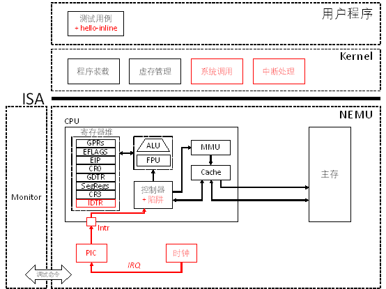
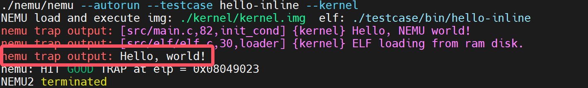

# PA 4-1 异常和中断的响应——来自外部的声音

在之前的程序执行过程中，我们都遵循着指令按序执行，遇到跳转指令则跳转到目的地址的次序来执行指令。这种执行指令的序列所得到的是正常控制流。而在程序正常执行的过程中，CPU经常会遇到来自内部的异常事件或者外部的中断事件而打断原来程序的执行，转而执行操作系统提供的针对这些事件的处理程序。此时形成的控制流就称为异常控制流。这些打断程序正常执行的事件就称为异常或中断。



## 代码实现
### 通过自陷实现系统调用
!!! info "通过自陷实现系统调用"
    1.在include/config.h中定义宏IA32_INTR并make clean；
    
    2.在nemu/include/cpu/reg.h中定义IDTR结构体，并在CPU_STATE中添加idtr；
    
    3.实现包括lidt、cli、sti、int、pusha、popa、iret等指令；
    
    4.在nemu/src/cpu/intr.c中实现raise_intr()函数;

IDTR与GDTR有着类似的结构，其中包含一个段界限和一个段选择子。段界限用于指示IDT表中描述符的个数，而段选择子用于指示IDT表中描述符的起始位置。我们容易给出实现如下
```C
typedef struct {
        uint32_t limit :16;
        uint32_t base :32;
}IDTR;
```

!!! tip "关于指令实现的一个小提示"
    正如我们多次提及的那样，我们在实现指令时，可以参考框架代码中提供的指令参考```__ref_```，或许大部分时间你觉得指令实现十分顺利，但是如果你遇到一些奇怪的问题时，这是一个十分重要的调试手段

与指令实现相关的内容，敬请参考```i386```手册。在本次实验中，我们需要更多注意顺序的问题。比如```pusha```和```popa```的顺序，```iret```与```raise_intr(uint8_t intr_no)```的顺序等等，否则也会发生一些期望之外的事件。


!!! note "逻辑自洽？一个有意思的实现"
    你不难注意到，如下实现也可以通过评测。但是如果将```iret```改为```__ref_iret```，则无法通过评测。这里涉及了一个自洽的问题，不过十分不推荐这样做。我们所做的```x86```编程模拟还是应该以模拟实际情况为核心；以及这样做很可能会对日后的调试造成困扰。
    ```C
    make_instr_func(iret)
    {
    #ifdef IA32_SEG
        opr_dest.addr = cpu.esp;
        opr_dest.sreg = SREG_SS;
        opr_dest.type = OPR_MEM;
        opr_dest.data_size = data_size;
        cpu.esp += data_size/8;
        operand_read(&opr_dest);
        cpu.eip = opr_dest.val;
        opr_dest.addr = cpu.esp;
        opr_dest.sreg = SREG_SS;
        opr_dest.type = OPR_MEM;
        opr_dest.data_size = data_size;
        cpu.esp += data_size/8;
        operand_read(&opr_dest);
        cpu.cs.val = opr_dest.val;
        opr_dest.addr = cpu.esp;
        opr_dest.sreg = SREG_SS;
        opr_dest.type = OPR_MEM;
        opr_dest.data_size = data_size;
        cpu.esp += data_size /8 ;
        operand_read(&opr_dest);
        cpu.eflags.val = opr_dest.val;
    #endif	
        return 0;
    }
    ```
    ```C
    void raise_intr(uint8_t intr_no){
    #ifdef IA32_INTR
	    opr_src.val = cpu.eflags.val;
        opr_src.data_size = 32;
        cpu.esp -= 4;
	    opr_src.addr = cpu.esp;
	    opr_src.sreg = SREG_SS;
	    opr_src.type = OPR_MEM;
	    operand_write(&opr_src);
	    opr_src.val = cpu.cs.val;
        opr_src.data_size = 16;
        cpu.esp -= 2;
	    opr_src.addr = cpu.esp;
	    opr_src.sreg = SREG_SS;
	    opr_src.type = OPR_MEM;
	    operand_write(&opr_src);
	    opr_src.val = cpu.eip;
        opr_src.data_size = 32;
        cpu.esp -= 4;
	    opr_src.addr = cpu.esp;
	    opr_src.sreg = SREG_SS;
	    opr_src.type = OPR_MEM;
	    operand_write(&opr_src);
        GateDesc temp_IDT;
        vaddr_t loc_ldt = cpu.idtr.base + intr_no * 8;
        temp_IDT.val[0] = laddr_read(loc_ldt, 4);
        temp_IDT.val[1] = laddr_read(loc_ldt + 4, 4);
        if(temp_IDT.type == 0xE)  cpu.eflags.IF = 0;
        cpu.eflags.TF = 0;
        cpu.cs.val = temp_IDT.selector;
        load_sreg(SREG_CS);
        cpu.eip = (temp_IDT.offset_31_16 << 16) + temp_IDT.offset_15_0;
    #endif
    }
    ```
    事实上，```pusha```和```popa```指令如果实现合适且逻辑自洽，也可以通过测试。


在完成上述实现后，我们在工程目录下运行```make test_pa-4-1```，可以观察到如下结果：



这标志我们顺利通过了PA4-1的代码模拟部分。

## 思考习题
!!! question "PA4-1-1"
    详细描述从测试用例中的int $0x80开始一直到HIT_GOOD_TRAP为止的详细的系统行为（完整描述控制的转移过程，即相关函数的调用和关键参数传递过程），可以通过文字或画图的方式来完成
当执行到```int $0x80```时，CPU会查找中断向量表（IDT），根据中断号0x80找到对应的门描述符并将当前的EFLAGS寄存器、代码段选择子（CS）和指令指针（EIP）压入栈中以保存当前的上下文，以及更新CS和EIP以指向中断服务例程的起始位置，这样就进入了内核态并开始执行内核代码。。这些操作是由opcode中```int_```指令通过```raise_sw_intr```调用```raise_intr```实现的。
门描述符包含了一个指向处理该中断的服务例程的指针以及一些其他信息（比如所需的特权级别，但是NEMU对此做了简化因此不需要考虑权限），在```intr.h```中给出了结构体很好的描述了其组成。我们依据selector字段与offset字段更新```CS:EIP```。
```C
typedef union GateDescriptor {
	struct
	{
		uint32_t offset_15_0 : 16;
		uint32_t selector : 16;
		uint32_t pad0 : 8;
		uint32_t type : 4;
		uint32_t system : 1;
		uint32_t privilege_level : 2;
		uint32_t present : 1;
		uint32_t offset_31_16 : 16;
	};
	uint32_t val[2];
} GateDesc;
```
在内核态下，执行的是```do_irq.S```中的代码（在此阶段前，会先经过一个```<vec>```的阶段，每一个```<vec>```由三行汇编代码构成，连续push两次后跳转至```asm_do_irq```），这部分代码首先会通过pusha指令保存所有通用寄存器的状态，push esp用于保存当前栈指针，这个栈指针指向一个TrapFrame结构，它包含了系统调用前的处理器状态（详见第2题）。接着调用irq_handle来处理特定的中断或异常。调用do_syscall函数进行系统调用（tf又当作参数传给了do_syscall），输出
```
Hello, world!
```
完成所有处理后，程序需要恢复之前保存的现场信息，即从栈中弹出先前保存的寄存器值。具体地，popa指令恢复通用寄存器（丢弃esp，ref i386手册第364页），执行一条特殊的指令如iret（中断返回）pop出EIP、CS和EFLAGS，使得控制权返回到用户空间，继续执行int $0x80之后的下一条指令。在```hello-inline```测试样例中即为HIT_GOOD_TRAP。


!!! question "PA4-1-2"
    在描述过程中，回答kernel/src/irq/do_irq.S中的push %esp起什么作用，画出在call irq_handle之前，系统栈的内容和esp的位置，指出TrapFrame对应系统栈的哪一段内容

在第1题中我们回答到push esp用于保存当前栈指针，这个栈指针指向一个TrapFrame结构，它包含了系统调用前的处理器状态。TrapFrame 是一个数据结构，它用来保存处理器在进入内核态之前的状态信息。当发生中断、异常或者系统调用时，CPU会自动保存一些寄存器的内容到栈上，包括：EFLAGS标志寄存器，CS代码段选择子，EIP指令指针，错误码irq，通用寄存器EAX, EBX, ECX等
我们知道在x86架构中栈是从高地址向低地址增长的，一个可能的示意图如下：

|我是栈，我上面还有...|
|:---:|
|eflags.val|
|cpu.cs.val|
|eip|
|eax|
|ecx|
|edx|
|ebx|
|esp（旧值，iret时会被throwaway）|
|ebp|
|esi|
|edi|
|（esp指向位置）|


!!! question "PA4-1-3"
    详细描述NEMU和Kernel响应时钟中断的过程和先前的系统调用过程不同之处在哪里？相同的地方又在哪里？可以通过文字或画图的方式来完成。

NEMU和Kernel响应时钟中断的过程和先前的系统调用过程不同之处有：从触发方式看，系统调用由用户程序通过特定指令（如int $0x80）主动发起请求操作系统服务；时钟中断由硬件定时器自动产生通知CPU时间已经流逝了一定的数量。从中断号看，系统调用中断号通常是固定的（如0x80），并且是通过软件指令明确指定的；时钟中断中断号由硬件决定，对于标准PC架构时钟中断一般对应于IRQ 0，会映射到IDT中的某个特定位置（32 + IRQ）。从处理逻辑看，系统调用内核根据传入的系统调用号执行相应的服务例程，之后返回到用户空间继续执行；时钟中断则可能处理与时钟相关的任务。
NEMU和Kernel响应时钟中断的过程和先前的系统调用过程相同之处有：中断处理流程无论是系统调用还是时钟中断，都会经历类似的步骤来保存现场信息（如PUSH EFLAGS、CS、EIP），查找并跳转至相应的中断处理程序，处理完毕后恢复现场信息并通过iret指令返回；两者都会导致CPU从用户态进入内核态，以允许内核代码执行关键操作；在模拟实现方面都与PA4-1-1中实现的```raise_intr```进行处理。

!!! success "PA-4-1阶段结束"
    “生命这样的旅程，要用多少泪水来完整

    心情如何？是不是快要期末考试了？

    相信你这个学期一定学到了很多东西，其中计算机系统基础的内容一定在其中占据了浓墨重彩的一笔。