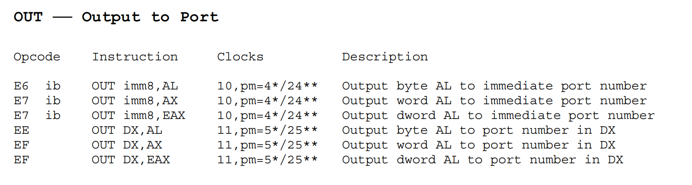

# PA 4-2 外设与I/O——来自外部的声音

在之前的几个阶段中，我们模拟了CPU的运算、指令执行；存储管理；异常和中断响应的相关功能。我们的模拟器功能已日趋完备！现在，我们可以向一台完整的计算机迈出最后的一步了。我们要在模拟器中增加与外部设备进行I/O的功能。如此我们的模拟器就能够实现包括键盘输入、屏幕输出等功能，能够与用户互动起来，完成除了运算以外更加丰富的功能。


### 串口的模拟

!!! info "完成串口的模拟"
    1. 在`include/config.h`中定义宏`HAS_DEVICE_SERIAL`并`make clean`；
    2. 实现`in`和`out`指令；
    3. 实现`serial_printc()`函数；
    4. 运行`hello-inline`测试用例，对比实现串口前后的输出内容的区别。

IN 指令用于从指定的I/O端口读取数据到CPU的寄存器中。该指令在汇编语言中是专门用来进行端口读操作的，允许CPU直接与外部设备通信。当执行 IN 指令时，CPU会根据提供的端口号从对应的I/O端口读取一个字节（8位）、一个字（16位）或双字（32位）的数据，并将其存储到目标寄存器中。


OUT 指令用于将CPU的寄存器中的数据写入到指定的I/O端口中。当执行 OUT 指令时，CPU会根据提供的端口号将目标寄存器中的数据写入到对应的I/O端口中。



通过与ref_opcode进行对比，我们容易知道需要我们实现的为
```C
   /* 0xec - 0xef*/ in_b, in_v, out_b, out_v,
```
其中b对应8位，v对应16位。

!!! note "端口映射I/O模拟"
    在nemu/src/device/io/port_io.c源文件中有一个pio_handler_table数组，其中维护了端口和外设之间的映射关系，即，端口号port和处理函数handler之间的对应关系。同时提供了两个接口函数pio_write()和pio_read()供out和in指令调用。pio_handler_table数组建立了某一个端口及其处理函数（handler）之间的对应关系，当对某一个端口进行读写时，会调用该端口对应的处理函数来模拟设备的相应动作。在nemu/include/device/port_io.h头文件中我们提供了宏make_pio_handler来帮助声明处理函数。

于是，我们可以写出如下代码
```C
/*nemu/src/cpu/instr/in.c*/
//调用函数原型uint32_t pio_read(uint16_t port, size_t len)
make_instr_func(in_b){
    opr_src.data_size = 8;
    opr_src.type = OPR_REG;
    opr_src.addr = REG_AL;
    opr_src.val = pio_read((cpu.edx & 0xFFFF), 1); //增强代码的健壮性
    operand_write(&opr_src);
    return 1;
}
make_instr_func(in_v){
    opr_src.data_size = 16;
    opr_src.type = OPR_REG;
    opr_src.addr = REG_AX;
    opr_src.val = pio_read((cpu.edx & 0xFFFF), 2); //增强代码的健壮性
    operand_write(&opr_src);
    return 1;
}
```
```C
/*nemu/src/cpu/instr/out.c*/
//调用函数原型void pio_write(uint16_t port, size_t len, uint32_t data)
make_instr_func(out_b){
    opr_src.data_size = 8;
    opr_src.type = OPR_REG;
    opr_src.addr = REG_AL;
    operand_read(&opr_src);
    pio_write((cpu.edx & 0xFFFF), 1, opr_src.val);
    return 1;
}
make_instr_func(out_v){
    opr_src.data_size = 16;
    opr_src.type = OPR_REG;
    opr_src.addr = REG_AX;
    operand_read(&opr_src);
    pio_write((cpu.edx & 0xFFFF), 2, opr_src.val);
    return 1;
}
```
并在相应的头文件中声明，将opcode对应位置修改后，就完成了IN和OUT指令的模拟。

下面就是实现`serial_printc()`函数，这个函数位于kernel/src/lib/serial.c中。

!!! note "serial_printc()的提示"
    在kernel/include/x86/io.h中框架代码已经封装好了in和out指令的调用，请选择合适的函数调用。具体而言，我们期望实现这个函数的功能是将传入的参数ch通过serial输出到控制台上。而封装好的与out相关函数有：
    ```C
    out_byte(uint16_t port, uint8_t data)
    out_word(uint16_t port, uint16_t data)
    out_long(uint16_t port, uint32_t data)
    ```

而传入的字符为char型，因此，我们只需要调用`out_byte()`即可，也就是说serial_printc()的实现如下：
```C
void serial_printc(char ch)
{
	while (!serial_idle());
	out_byte(SERIAL_PORT,ch);
}
```
以上，我们完成了串口的模拟，在`make test_pa-4-2`运行`hello-inline`测试用例，对比实现串口前后的输出内容的区别。可以发现，输出内容前的```nemu trap output: ```标记消失了，这标志着我们通过了PA-4-2的第一阶段。


### 硬盘的加载

!!! info "实现从硬盘加载程序"
    1. 在`include/config.h`中定义宏`HAS_DEVICE_ID`并`make clean`；

    2. 修改Kernel中的`loader()`，使其通过`ide_read()`和`ide_write()`接口实现从模拟硬盘加载用户程序；

    3. 通过`make test_pa-4-2`执行测试用例，验证加载过程是否正确。

### 键盘的交互
!!! info "完成键盘的模拟"
    1. 在`include/config.h`中定义宏`HAS_DEVICE_KEYBOARD`并`make clean`；

    2. 通过`make test_pa-4-2`运行`echo`测试用例；（可以通过关闭窗口或在控制台Ctrl-c的方式退出`echo`）

### 缤纷的世界
!!! info "实现VGA的MMIO"
    1. 在`include/config.h`中定义宏`HAS_DEVICE_VGA`；

    2. 在`nemu/src/memory/memory.c`中添加`mm_io`判断和对应的读写操作；

    3. 在`kernel/src/memory/vmem.c`中完成显存的恒等映射；

    4. 通过`make test_pa-4-2`执行测试用例，观察输出测试颜色信息，并通过`video_mapping_read_test()`。