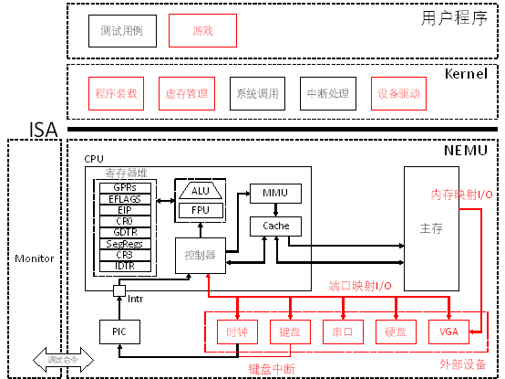
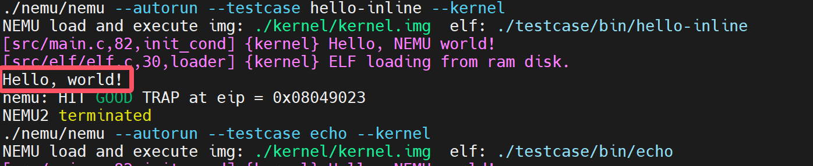
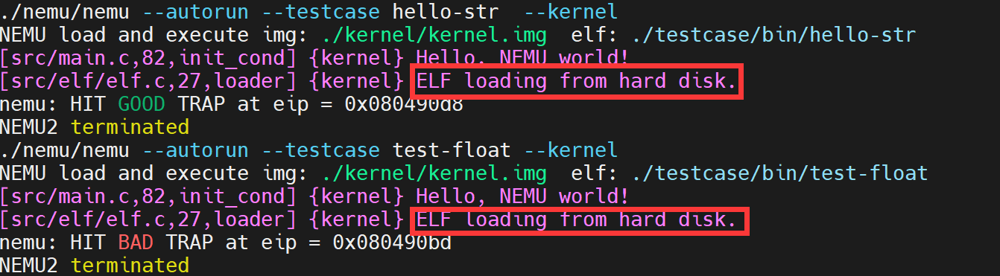
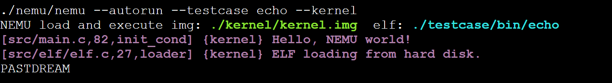
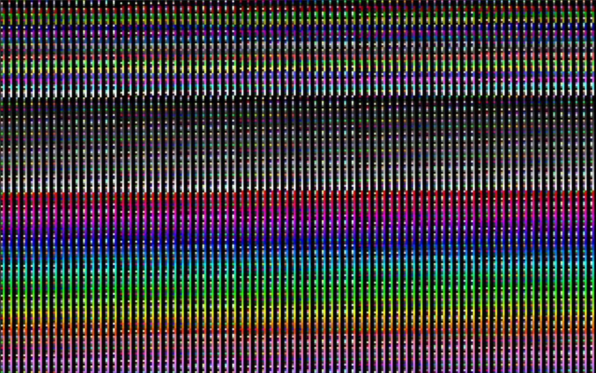

# PA 4-2 外设与I/O——冯诺依曼的构想

在之前的几个阶段中，我们模拟了CPU的运算、指令执行；存储管理；异常和中断响应的相关功能。我们的模拟器功能已日趋完备！现在，我们可以向一台完整的计算机迈出最后的一步了。我们要在模拟器中增加与外部设备进行I/O的功能。如此我们的模拟器就能够实现包括键盘输入、屏幕输出等功能，能够与用户互动起来，完成除了运算以外更加丰富的功能。



!!! question "冯诺依曼的构想？"
    冯·诺依曼体系结构是现代计算机的基础，现在大多计算机仍是冯·诺依曼计算机的组织结构上作了一些改进。冯·诺依曼也因此被人们称为“计算机之父”。

    如你所见，尽管我们在理论课程学习的第一章就学习了冯·诺依曼体系结构，但是时至今日我们的NEMU才将其五大组成部分都实现模拟。

    将指令和数据同时存放在存储器中，是冯·诺依曼计算机方案的特点之一。在这一体系下我们认为计算机由控制器、运算器、存储器、输入设备、输出设备五部分组成。我们在很早就实现了CPU、内存、寄存器等部分，但是还没有实现I/O设备。

    在本阶段中，我们将实现I/O设备，使NEMU能够与用户进行交互，完成更加丰富的功能，从而实现一个完整的计算机，因此我们称这一阶段为“冯诺依曼的构想”。

## 代码实现

### 串口的模拟

!!! info "完成串口的模拟"
    1. 在`include/config.h`中定义宏`HAS_DEVICE_SERIAL`并`make clean`；
   
    2. 实现`in`和`out`指令；
   
    3. 实现`serial_printc()`函数；
   
    4. 运行`hello-inline`测试用例，对比实现串口前后的输出内容的区别。

IN 指令用于从指定的I/O端口读取数据到CPU的寄存器中。该指令在汇编语言中是专门用来进行端口读操作的，允许CPU直接与外部设备通信。当执行 IN 指令时，CPU会根据提供的端口号从对应的I/O端口读取一个字节（8位）、一个字（16位）或双字（32位）的数据，并将其存储到目标寄存器中。


OUT 指令用于将CPU的寄存器中的数据写入到指定的I/O端口中。当执行 OUT 指令时，CPU会根据提供的端口号将目标寄存器中的数据写入到对应的I/O端口中。


通过与ref_opcode进行对比，我们容易知道需要我们实现的为
```C
   /* 0xec - 0xef*/ in_b, in_v, out_b, out_v,
```

!!! note "端口映射I/O模拟"
    在nemu/src/device/io/port_io.c源文件中有一个pio_handler_table数组，其中维护了端口和外设之间的映射关系，即，端口号port和处理函数handler之间的对应关系。同时提供了两个接口函数pio_write()和pio_read()供out和in指令调用。pio_handler_table数组建立了某一个端口及其处理函数（handler）之间的对应关系，当对某一个端口进行读写时，会调用该端口对应的处理函数来模拟设备的相应动作。在nemu/include/device/port_io.h头文件中我们提供了宏make_pio_handler来帮助声明处理函数。

于是，我们可以写出如下代码
```C
/*nemu/src/cpu/instr/in.c*/
//调用函数原型uint32_t pio_read(uint16_t port, size_t len)
make_instr_func(in_b){
    opr_src.data_size = 8;
    opr_src.type = OPR_REG;
    opr_src.addr = REG_AL;
    opr_src.val = pio_read((cpu.edx & 0xFFFF), 1);
    operand_write(&opr_src);
    return 1;
}
make_instr_func(in_v){
    opr_src.data_size = data_size;
    opr_src.type = OPR_REG;
    opr_src.addr = REG_AX;
    opr_src.val = pio_read((cpu.edx & 0xFFFF), data_size/8);
    operand_write(&opr_src);
    return 1;
}
```
```C
/*nemu/src/cpu/instr/out.c*/
//调用函数原型void pio_write(uint16_t port, size_t len, uint32_t data)
make_instr_func(out_b){
    opr_src.data_size = 8;
    opr_src.type = OPR_REG;
    opr_src.addr = REG_AL;
    operand_read(&opr_src);
    pio_write((cpu.edx & 0xFFFF), 1, opr_src.val);
    return 1;
}
make_instr_func(out_v){
    opr_src.data_size = data_size;
    opr_src.type = OPR_REG;
    opr_src.addr = REG_AX;
    operand_read(&opr_src);
    pio_write((cpu.edx & 0xFFFF), data_size/8, opr_src.val);
    return 1;
}
```
并在相应的头文件中声明，将opcode对应位置修改后，就完成了IN和OUT指令的模拟。

!!! bug "IN和OUT指令的一个错误实现"
    这个错误实现能通过PA4-2的第一阶段，但是在日后的征途中会暴露出来。这个甚至应该被称为低级的错误导致的异常现象曾经困扰了我很久、很久。
    ```C
    make_instr_func(in_v){
        opr_src.data_size = 16;
        opr_src.type = OPR_REG;
        opr_src.addr = REG_AX;
        opr_src.val = pio_read((cpu.edx & 0xFFFF), 2);
        operand_write(&opr_src);
        return 1;
    }
    ```

下面就是实现`serial_printc()`函数，这个函数位于kernel/src/lib/serial.c中。

!!! note "serial_printc()的提示"
    在kernel/include/x86/io.h中框架代码已经封装好了in和out指令的调用，请选择合适的函数调用。具体而言，我们期望实现这个函数的功能是将传入的参数ch通过serial输出到控制台上。而封装好的与out相关函数有：
    ```C
    out_byte(uint16_t port, uint8_t data)
    out_word(uint16_t port, uint16_t data)
    out_long(uint16_t port, uint32_t data)
    ```

而传入的字符为char型，因此，我们只需要调用`out_byte()`即可，也就是说serial_printc()的实现如下：
```C
void serial_printc(char ch)
{
	while (!serial_idle());
	out_byte(SERIAL_PORT,ch);
}
```
以上，我们完成了串口的模拟，在`make test_pa-4-2`运行`hello-inline`测试用例，对比实现串口前后的输出内容的区别。可以发现，输出内容前的```nemu trap output: ```标记消失了，这标志着我们通过了PA-4-2的第一阶段。


### 硬盘的加载

!!! info "实现从硬盘加载程序"
    1. 在`include/config.h`中定义宏`HAS_DEVICE_ID`并`make clean`；

    2. 修改Kernel中的`loader()`，使其通过`ide_read()`和`ide_write()`接口实现从模拟硬盘加载用户程序；

    3. 通过`make test_pa-4-2`执行测试用例，验证加载过程是否正确。

在Kernel中的`kernel/src/driver/ide`文件夹中，包含了对硬盘驱动程序的封装。`disk.c`源文件中提供的`ide_read()`和`ide_write()`函数是磁盘驱动程序对外提供的接口，供其它模块调用实现对磁盘的读写。我们可以观察到，```ide_read```函数循环调用 read_byte 函数逐个字节地从指定的磁盘偏移量处读取数据，并将其存储到由 buf 指向的内存缓冲区中。每次迭代都会增加偏移量 offset，从而确保连续读取相邻的字节；```ide_write```函数也是通过循环调用 write_byte 来逐个字节地将数据从内存缓冲区写回到磁盘上相应的偏移位置。随着循环的推进，offset 增加，确保每个新字节都被正确地放置在其应有的位置上。这两个函数原型牵涉到我们在```elf.c```中对其的调用。
```C
void ide_read(uint8_t *buf, uint32_t offset, uint32_t len)
{
	uint32_t i;
	for (i = 0; i < len; i++)
	{
		buf[i] = read_byte(offset + i);
	}
}

void ide_write(uint8_t *buf, uint32_t offset, uint32_t len)
{
	uint32_t i;
	for (i = 0; i < len; i++)
	{
		write_byte(offset + i, buf[i]);
	}
}
```
!!! note "一个投机取巧的实现"
    事实上，用如下的代码也可以实现对硬盘读写的模拟，但是，这并不是一个好的实现。
    ```C
    #ifdef HAS_DEVICE_IDE
            ide_read((uint8_t*)paddr,ph->p_offset,ph->p_filesz);
    #else            
            memcpy((void*)paddr, (void*)elf + ph->p_offset, ph->p_filesz);
    #endif
    ```
    这里没有使用```ide_write()```函数，而是直接将用户程序进行拷贝到，这不是一个好的实现。但是，有意思的是在PA的PPT中，给出了如下的提示，似乎在暗示着什么。
    > 提示：有些接口这里用不到咱就不用

在完成从硬盘加载程序的模拟后，我们可以通过`make test_pa-4-2`执行测试用例，观察输出测试信息，会发现ELF文件的装载```Log```信息由```ELF loading from ram disk.```变为了```ELF loading from hard disk.```并且测试用例执行正常，这标志着我们通过了PA-4-2的第二阶段。


### 键盘的交互
!!! info "完成键盘的模拟"
    1. 在`include/config.h`中定义宏`HAS_DEVICE_KEYBOARD`并`make clean`；

    2. 通过`make test_pa-4-2`运行`echo`测试用例；（可以通过关闭窗口或在控制台Ctrl-c的方式退出`echo`）

这一阶段在代码部分似乎对于我们没有提出很高要求，如果前述实现正确，我们可以相对容易观察到本阶段的正确通过。在实现了模拟键盘后，我们能开启最后一个测试用例`echo`。运行`echo`，每次在窗口中键入一个英文字母，就会在标准输出中打印一个对应的大写字母，这标志着我们通过了PA-4-2的第三阶段。



### 缤纷的世界
!!! info "实现VGA的MMIO"
    1. 在`include/config.h`中定义宏`HAS_DEVICE_VGA`；

    2. 在`nemu/src/memory/memory.c`中添加`mm_io`判断和对应的读写操作；

    3. 在`kernel/src/memory/vmem.c`中完成显存的恒等映射；

    4. 通过`make test_pa-4-2`执行测试用例，观察输出测试颜色信息，并通过`video_mapping_read_test()`。
   
这里我暂时不想过多解释，因为不少奇怪的实现也不会触发`video_mapping_read_test()`的失败，这也很有意思。实现VGA后可能的颜色输出如下：



事实上，如果在执行过程中没有遇到```assert```终止，那么就意味着通过了PA-4-2的第四阶段的`video_mapping_read_test()`。
```c
void video_mapping_read_test()
{
	int i;
	uint32_t *buf = (void *)VMEM_ADDR;
	for (i = 0; i < SCR_SIZE / 4; i++)
	{
		assert(buf[i] == i);
	}
}
```

## 思考习题

```C
#include "trap.h"
#include <stdint.h>
#include <sys/syscall.h>

// read a byte from the port
uint8_t in_byte(uint16_t port)
{
	uint8_t data;
	asm volatile("in %1, %0"
				 : "=a"(data)
				 : "d"(port));
	return data;
}

// register a handle of interrupt request in the Kernel
void add_irq_handler(int irq, void *handler)
{
	// refer to kernel/src/syscall/do_syscall.c to understand what has happened
	asm volatile("int $0x80"
				 :
				 : "a"(0), "b"(irq), "c"(handler));
}

void writec(int fd, char c)
{
	asm volatile("int $0x80"
				 :
				 : "a"(SYS_write), "b"(fd), "c"(&c), "d"(1));
}

void printc(char c)
{
	writec(1, c);
}

char translate_key(int scan_code);

// the keyboard event handler, called when an keyboard interrupt is fired
void keyboard_event_handler()
{

	uint8_t key_pressed = in_byte(0x60);

	// translate scan code to ASCII
	char c = translate_key(key_pressed);
	if (c > 0)
	{
		// can you now fully understand Fig. 8.3 on pg. 317 of the text book?
		printc(c);
	}
}

int main()
{
	// register for keyboard events
	add_irq_handler(1, keyboard_event_handler);
	while (1)
		asm volatile("hlt");
	return 0;
}

// scan code for letter a-z
static int letter_code[] = {
	30, 48, 46, 32, 18, 33, 34, 35, 23, 36,
	37, 38, 50, 49, 24, 25, 16, 19, 31, 20,
	22, 47, 17, 45, 21, 44};

char translate_key(int scan_code)
{
	int i;
	for (i = 0; i < 26; i++)
	{
		if (letter_code[i] == scan_code)
		{
			return i + 0x41;
		}
	}
	return 0;
}
```

!!! question 
    针对echo测试用例，在实验报告中，结合代码详细描述：注册监听键盘事件是怎么完成的？

用户态程序通过调用`add_irq_handler`请求注册一个中断处理函数；`add_irq_handler`构建并发起一个系统调用，使用`int 0x80`指令切换到内核态。内核接收到系统调用请求后，基于eax寄存器的值选择并执行对应的系统调用处理函数`do_syscall`。在`do_syscall`中，根据传递过来的参数调用`add_irq_handle`函数。`add_irq_handle`函数负责将新的中断处理函数添加到内核的中断处理机制中，以便在未来发生相应中断时能够正确响应。在`add_irq_handle`函数中，中断处理函数被存储在一个称为`handle`的数组中，这个数组可能就是中断向量表的一部分或者是专门为此目的设置的数据结构。这一步完成了中断处理函数的实际注册过程。


!!! question 
    从键盘按下一个键到控制台输出对应的字符，系统的执行过程是什么？如果涉及与之前报告重复的内容，简单引用之前的内容即可。

首先，当用户按下键盘上的某个键时，NEMU中的`NEMU_SDL_Thread()`会捕获到这个键盘事件并传递给`keyboard_event_handler`函数进行处理。在这个处理函数中，程序调用了`in_byte`函数以获取键盘的具体输入内容。`in_byte`函数的作用是从硬件接口读取数据，并将结果存放在寄存器eax中。接下来需要对其进行译码，以便将其转换成可以理解的字符。完成译码后，通过调用`printfc`函数进一步处理。`printfc`函数内部调用了`writec`函数，而`writec`函数则使用了系统调用`SYS_write`来实现字符的输出。当`SYS_write`被调用时，控制权转移到内核态下的`do_syscall`函数。`do_syscall`会调用`fs_write`函数，在`fs_write`内部调用了`serial_printc`函数。这个函数负责将字符发送到串行端口或任何其他指定的输出设备。为了实现这一点，`serial_printc`函数内部使用了`out_byte`函数，它将数据写入特定的I/O端口地址，从而完成数据的实际传输。

!!! success "PA-4-2阶段结束"
    今夕是何年？

    考完期末了吗？如果考完了，感觉如何；如果还没有，你准备好了吗？
    
    至此，PA所有必做任务已经全部完成，你有什么想说的吗？如果你发现了任何记录中的问题，或你有什么想说的，请不要犹豫给我发送邮件。