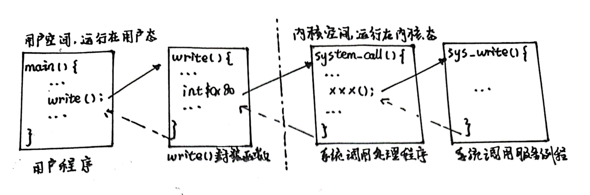
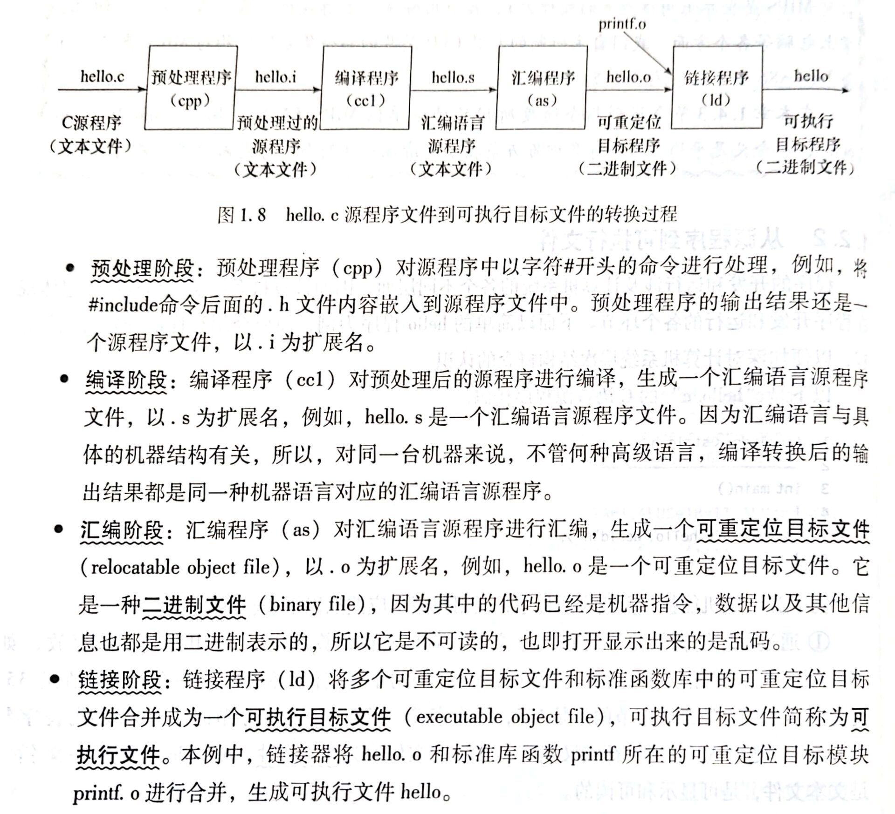

## 《计算机系统基础》第8章 I/O操作的实现  习题选解

---
### 第3题
（1）对于该IA-32+Linux系统中执行的用户程序P，该程序的功能是在标准输出设备上输出字符串```Hello, world.\n```。事实上，我们注意到第4题中给出了用户程序功能等价的C语言代码：
```C
int main(){
    write(1,"Hello, world.\n", 14);
    exit(0);
}
```
（2）注意到程序中有两处陷阱指令```int $0x80```，分别位于16行、20行，执行这两条指令时会从用户态转到内核态执行。
（3）根据注释，我们容易知道用户程序调用了系统调用号为4的```sys_write```和系统调用号为1的```sys_exit```。

### 第4题
（1）执行陷阱指令```int $0x80```时，传递给write()的实参在main栈帧可能的存放情况如下
| main栈帧 |
|:---:|
|···|
|14（字符串长度）|
|$msg（字符串首地址）|
|1（文件描述符）| 

↑ESP

（2）从执行write()函数开始到调出write系统调用服务例程sys_write()执行的过程中函数调用关系可以参考《计算机系统基础》8.1节图8.3画出


（3）就程序设计的便捷性与灵活性，本题中的实现方式好于第3题中的实现方式；就程序执行性能方面，第3题中的实现方式好于本题中的实现方式。

### 第5题
（1）hello.c中使用了stdio.h头文件中声明的printf()函数，因此需要在第一行包含头文件，即加上```#include<stdio.h>```。根据《计算机系统基础》4.3.3节内容，链接器可以在库文件的目标模块中找到对于printf()的定义，不会导致链接错误。
（2）根据《计算机系统基础》第1.2.2节（梦开始的地方）内容，从hello.c到可执行目标文件hello需要经过预处理阶段、编译阶段、汇编阶段、链接阶段，然后启动hello程序可以执行。各阶段的处理过程如下：

（3）根据《计算机系统基础》8.2.1节内容，printf()函数默认输出设备为stdout，这也是本题现象的原因。
（4）根据《计算机系统基础》2.5.1节内容，西文字符串在机器中以ASCII码存储，即为
```
48 65 6C 6C 6F 2C 20 77 6F 72 6C 64 0A 00
H  e  l  l  o  ,     w  o  r  l  d  !  \n
```
根据《计算机系统基础》4.2.2节内容，可知printf语句中的格式串、switch-case等开关语句的跳转表位于ELF可重定位目标文件的.rodata只读数据节中，因此这个0/1序列被保存在hello.o的.rodata节。
根据《计算机系统基础》4.2.3节内容，链接器将互相关联的可重定位目标文件中相同的代码届和数据节合并后形成可执行目标文件中对应的节，其中ELF头、程序头表、.init .fini节、.text节、.rodata节均位于只读（代码）段。因此这个0/1序列在可执行目标文件hello的只读（代码）段中。
（5）根据《计算机系统基础》4.3.3节内容，静态库文件采用一种称为存档档案的特殊文件格式，使用.a后缀，标准C函数库文件名为libc.a。因此prinf.o模块位于静态库libc.a中，printf.o中的代码部分也被映射到虚拟地址空间的只读（代码）段中。
根据《计算机系统基础》4.5.2节内容，采用动态链接printf.o中的代码部分位于虚拟地址空间的共享库区，可执行目标文件中加入了一个特殊的.interp节包含动态链接器的路径名。
（6）根据《计算机系统基础》第2、3、7、8章内容，
```Am
804f8fa: 53                 push %ebx                   #保存EBP旧值
804f8fb: 8b 64 24 10        mov 0x10(%esp), %edx        #字符串长度送EDX
804f8ff: 8b 4c 24 0c        mov 0xc(%esp), %ecx         #字符串首地址送ECX
804f903: 8b 5c 24 08        mov 0x8(%esp), %ebx         #字符串首地址送EBX
804f907：b8 04 00 00 00     mov $0x4, %eax              #系统调用号4送EAX（对应系统调用服务例程sys_write）
804f90c：cd 80              int $80                     #陷阱指令，陷入内核态系统调用
804f90e: 5d                 pop %ebx                    #恢复EBP旧值
804f90f: 3d 01 f0 ff ff     cmp $0xfffff001, %eax       #比较系统调用返回值与-4095
804f914: 0f 83 f6 1f 00 00 jae 8051910<__syscall_error> #大于等于时跳转至出错处理
804f91a: c3                 ret                         #返回
```
（7）就程序设计的便捷性与灵活性，本题中的实现方式好于第3题和第4题中的实现方式；就程序执行性能方面，第3题和第4题中的实现方式好于本题中的实现方式。

### 第8题
打印机最快速率为
\[
    \frac{6页 \times 50行 \times 80字符}{60s} = 400字符/s
\]
采用中断控制I/O方式实现字符打印，中断请求间隔为
\[
    \frac{1s}{400字符/s} = 2.5ms
\]
执行中断服务时间
\[
    1000 \times \frac{1}{500MHz} = 2\mu s
\]
因此可以使用中断控制I/O方式实现字符打印。

### 第9题
外设最大数据传输速率为20KB/s，外设接口数据缓存器为16位，采用中断控制I/O方式实现外设的输入输出，中断请求间隔为
\[
    \frac{1}{\frac{20KB/s}{2B}} = 10^{-3} s = 0.1 ms
\]
执行中断服务时间
\[
    500 \times \frac{1}{500MHz} = 1\mu s
\]
因此可以使用中断控制I/O方式实现外设的输入输出。

外设最大数据传输速率为2MB/s，外设接口数据缓存器为16位，采用中断控制I/O方式实现外设的输入输出，中断请求间隔为
\[
    \frac{1}{\frac{2MB/s}{2B}} = 1^{-6} s = 1 \mu s
\]
执行中断服务时间
\[
    500 \times \frac{1}{500MHz} = 1\mu s
\]
考虑到除中断服务程序执行时间，还有其他时间花费，实际中断响应处理时间多于$1\mu s$，中断请求间隔时间小于实际中断响应处理时间，因此不可以使用中断控制I/O方式实现外设的输入输出。

### 第12题
磁盘的平均数据传输速率为
\[
    10^{3} \times 16 \times 512B/8.192ms = 1MB/s
\]
中断请求间隔为
\[
    \frac{1}{\frac{1MB/s}{2B}} =  2\mu s
\]
期间CPU执行指令条数为
\[
    \frac{2 \mu s}{500ns} = 4
\]
每4条指令被插入一个总线周期用于数据传输，平均每条指令延长时间为
\[
    \frac{ 250ns }{4} = 62.5ns
\]
指令执行速度降低
\[
    \frac{62.5ns}{500ns} \times 100\% = 12.5\%
\]

---
